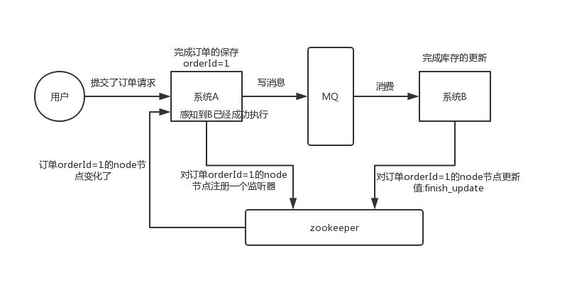
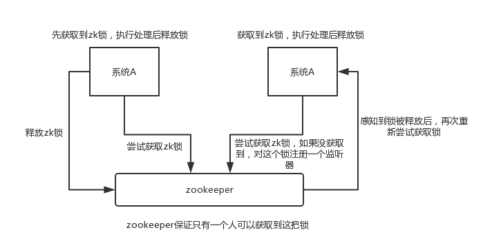
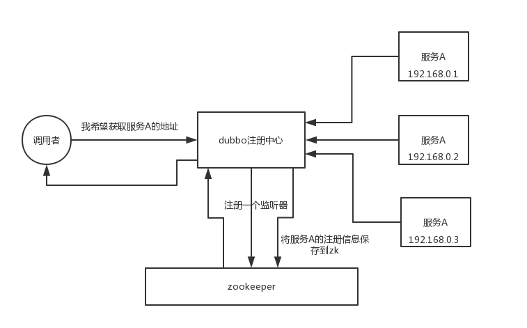
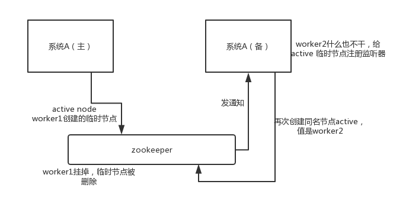

#分布式:
   ###如何设计一个高并发系统？
        1.系统拆分
            将一个系统拆分为多个子系统，然后每个系统连一个数据库，现在多个数据库，扛住的并发比一个库要高。
        2.缓存
            集群+主从模式+哨兵集群
        3.MQ
            缓存数据随时可能就被 LRU ,但是可以通过异步消息提升并发性,消费的速度控制在 mysql 承载范围之内
            
        4.分库分表
            将一个数据库拆分为多个库,将一个表拆分为多个表
        5.读写分离
            主库写入，从库读取，搞一个读写分离。读流量太多的时候，还可以加更多的从库。
        6.ElasticSearch
            比较简单的查询、统计类的操作，可以考虑用 es 来承载，还有一些全文搜索类的操作，也可以考虑用 es 来承载。
   ###分布式锁:
   ####Zookeeper:
        使用场景: 1.分布式协调    如图1
                        A 系统发送个请求到 mq，然后 B 系统消息消费之后处理了。
                        那 A 系统如何知道 B 系统的处理结果？用 zookeeper 就可以实现分布式系统之间的协调工作。
                        A 系统发送请求之后可以在 zookeeper 上对某个节点的值注册个监听器，一旦 B 系统处理完了就修改 zookeeper 那个节点的值，A 系统立马就可以收到通知
   图1
   
                  2.分布式锁      如图2
                        对某一个数据连续发出两个修改操作，两台机器同时收到了请求，
                        但是只能一台机器先执行完另外一个机器再执行。那么此时就可以使用 zookeeper 分布式锁，
                        一个机器接收到了请求之后先获取 zookeeper 上的一把分布式锁，就是可以去创建一个 znode，接着执行操作；
                        然后另外一个机器也尝试去创建那个 znode，结果发现自己创建不了，因为被别人创建了，那只能等着，
                        等第一个机器执行完了自己再执行
   图2
               
                  3.元数据/配置信息管理   如图3
                        zookeeper 可以用作很多系统的配置信息的管理，比如 kafka、storm 等等很多分布式系统都会选用 zookeeper 来做一些元数据、配置信息的管理，
                        包括 dubbo 注册中心不也支持 zookeeper 么
   图3
    
                  4.HA高可用性     如图4
                        比如 hadoop、hdfs、yarn 等很多大数据系统，都选择基于 zookeeper 来开发 HA 高可用机制，
                        就是一个重要进程一般会做主备两个，主进程挂了立马通过 zookeeper 感知到切换到备用进程。
   图4   
            
        临时节点羊群效应: 如果服务有很多,同时去监听某一个节点,节点释放会通知所有服务器.这对服务器是很大的一个挑战，一个释放的消息，
                    就好像一个牧羊犬进入了羊群，大家都四散而开，随时可能干掉机器，会占用服务资源，网络带宽等等。
             解决方案: 临时顺序节点,每个服务只监听自己的前一个节点.
        缺点: 每次需要动态创建和删除节点, 可靠性高,但是耗性能.
            并发高的情况下,建议使用redis分布式锁, 需要可靠性来说建议使用zk分布式锁
        
        主从切换带来的锁丢失问题: 集群可以解决锁丢失问题
        它有二阶段提交的方式 只有等一半以上的从节点执行成功后，才会返回给客户端
        不会产生死锁，就算机器挂了，它本身也会去释放这个临时节点
        
   #ZAB（Zookeeper Atomic Broadcast）
       是为ZooKeeper协设计的崩溃恢复原子广播协议，它保证zookeeper集群数据的一致性和命令的全局有序性。
       
   
   ####Redis 分布式锁: (redLock红锁)(redisson)
       官方分布式锁: https://github.com/redisson/redisson
                     https://github.com/redisson/redisson/wiki/8.-Distributed-locks-and-synchronizers
       重要的考量点:
                   1.互斥（只能有一个客户端获取锁）
                   2.不能死锁
                   3.容错（只要大部分 Redis 节点创建了这把锁就可以）
       redis分布式锁逻辑: (自写)
                   1.setnx(lockkey, 当前时间+过期超时时间) ，如果返回1，则获取锁成功；如果返回0则没有获取到锁，转向2。
                   2.get(lockkey)获取值oldExpireTime ，并将这个value值与当前的系统时间进行比较，如果小于当前系统时间，则认为这个锁已经超时，可以允许别的请求重新获取，转向3。
                   3.计算newExpireTime=当前时间+过期超时时间，然后getset(lockkey, newExpireTime) 会返回当前lockkey的值currentExpireTime。
                   4.判断currentExpireTime与oldExpireTime 是否相等，如果相等，说明当前getset设置成功，获取到了锁。如果不相等，
                       说明这个锁又被别的请求获取走了，那么当前请求可以直接返回失败，或者继续重试。
                   5.在获取到锁之后，当前线程可以开始自己的业务处理，当处理完毕后，比较自己的处理时间和对于锁设置的超时时间，
                       如果小于锁设置的超时时间，则直接执行delete释放锁；如果大于锁设置的超时时间，则不需要再锁进行处理。
                       
       redisson: 
                   1.加锁机制:
                       1.线程去获取锁，获取成功: 执行lua脚本，保存数据到redis数据库。
                       2.线程去获取锁，获取失败: 一直通过while循环尝试获取锁，获取成功后，执行lua脚本，保存数据到redis数据库。
                   2.watch dog自动延期机制
                       执行时间超过了锁的ttl,存在2个线程同时拥有锁,看门狗可以延长锁的ttl,但是会影响性能,不建议开启
                   3.lua脚本
                   4.可重入加锁机制
                       hash存储结构,<key,<key1,value>>  
             缺陷:
                   哨兵模式下:
                     获取分布式锁后,异步复制给从节点。但是过程中发生 master节点宕机，导致主备切换，此时slave节点没有同步到分布式锁的信息
                     slave节点从变为了 master节点。这时客户端2 来尝试加锁的时候，在新的master节点上也能加锁，此时就会导致多个客户端对同一个分布式锁完成了加锁。
                       
   ####redis 分布式锁和 zk 分布式锁的对比:
       redis 分布式锁，是自旋锁,拿到为止,而zk获取不到,主要注册个监听器,不会循环获取锁,性能开销较小
       如获取锁的线程宕机后,redis需要在ttl时间过了才能释放,而zk创建的是临时节点,线程宕机了,节点也就没有了,会自动释放
       
