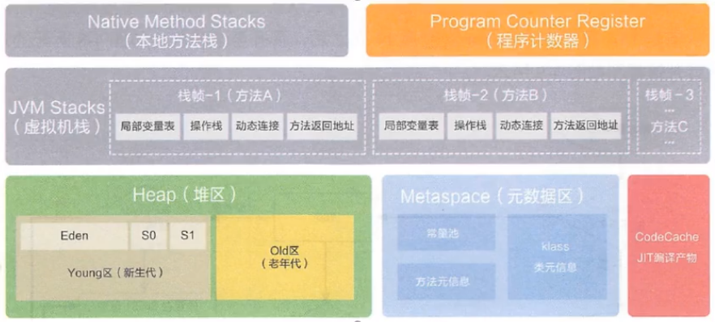
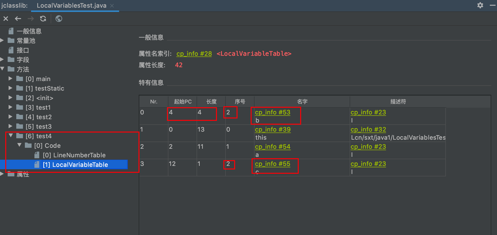
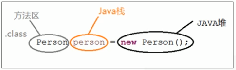
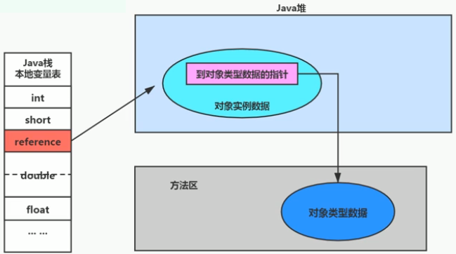

#JVM
###类加载该过程

####1.加载
    1.通过一个类的全限定类名获取定义此类的二进制字节流
    2.将这个字节流所代表的的静态存储结构转化为方法区的运行时数据结构
    3.在内存中生成一个代表这个类的java.lang.Class对象，作为方法区这个类的各种数据的访问入口
####加载.class文件的方式
    从本地系统中、网络获取（Web Applet）、gzip压缩包（jar、war）、JSP、加密文件

####2.验证
    目的在于确保Class文件的字节流中包含信息符合当前虚拟机要求，保证被加载类的正确性，不会危害虚拟机自身安全
    字节码是否已CAFE BABE开头、主要包括四种验证，文件格式验证，元数据验证，字节码验证，符号引用验证。
####3.准备
    为类变量分配内存并且设置该类变量的默认初始值，即零值
    这里不包含用final修饰的static，因为final在编译的时候就会分配好了默认值，准备阶段会显式初始化
    （类变量会分配在方法区中，而实例变量是会随着对象一起分配到Java堆中）
####4.解析
    将常量池内的符号引用转换为直接引用的过程（其实是在初始化之后）
    解析动作主要针对类或接口、字段、类方法、接口方法、方法类型等。
    ps; java全部都是直接引用:
            变量直接指向堆地址
            好处是访问快、弊端是垃圾回收改了堆的位置后，需要在变量中重新修改指向堆的地址值
        间接引用用的是句柄池，变量到句柄池，在到堆地址
            好处是垃圾回收改了更新了堆地址后只需要修改句柄池中的地址、弊端是相对直接引用访问会慢一点
    

####5.初始化
    执行类构造器方法<clinit>()的过程
    由编译器生成，如果类中没有static变量，则不会有clinit方法，（clinit方法中的指令按语句在源文件中出现的顺序执行）
    若该类具有父类，JVM会保证子类的<clinit>()执行前，父类的<clinit>()已经执行完毕
    虚拟机必须保证一个类的<clinit>()方法在多线程下被同步加锁

###类加载器的分类
    分为引导类加载器（Bootstrap ClassLoader）和自定义类加载器（User-Defined ClassLoader）
    1.启动类加载器(引导类加载器)
        C++实现，加载Java的核心库，没有父类加载器
    2.扩展类加载器
        继承于ClassLoader类，从java.ext.dirs系统属性所指定的目录中加载类库，或从JDK的安装目录的 jre / lib / ext子目录（扩展目录）下加载类库。
    3.系统类加载器
        继承于ClassLoader类，程序中默认的类加载器
    4.用户自定义类加载器
        好处：隔离加载类、修改类加载的方式、扩展加载源、防止源码泄露
        实现：实现ClassLoader，重写findclass方法，不建议重写loadclass方法，因为loadclass方法中有双亲委派的原则，不希望被打破
        
###双亲委派机制
    概念：比如一个自己写的类,需要加载,被系统类加载器扫描到,他会抛给他的上级,给扩展类,然后启动类,发现他们都处理不了,
            然后在从启动类,到扩展类,到系统类,然后在加载,这就是双亲委派机制
    优势：避免类的重复加载
          保护程序安全，防止核心API被随意篡改
    就算我重写了loadclass方法，破坏了双亲委派机制，但是最终也不能加载自定义的String类，因为defineClass方法最终调用preDefineClass会保护JDK的核心类库
      
    
###破坏双亲委派机制
    通过线程上下文类加载器来感知下游类加载器的类
    双亲委派模型的第三次“被破坏”是由于用户对程序动态性的追求而导致的。如:代码热替换（Hot Swap）、模块热部署（Hot Deployment）等

###沙箱安全机制
    虚拟机会把所有代码加载到不同的系统域和应用域。系统域部分专门负责与关键资源进行交互，
    而各个应用域部分则通过系统域的部分代理来对各种需要的资源进行访问。
    虚拟机中不同的受保护域（Protected Domain），对应不一样的权限（Permission）。
    存在于不同域中的类文件就具有了当前域的全部权限，如下图所示，最新的安全模型（jdk1.6）
    ps：加载自定义类String的时候，向上委托，其他加载的是核心类库中的String，调用main的时候，发现核心类库中没有该方法，所以就报错，这就是沙箱保护机制

#jvm问题
###如何判断两个class对象相同？
    同一个类加载器加载、全限定类名一致
###类的主动使用和被动使用
    主动使用：
        创建类的实例
        访问某个类或接口的静态变量，或者对该静态变量赋值
        调用类的静态方法
        反射（ 比如：Class.forName(“cn.sxt.Test”) )
        初始化一个类的子类
        Java虚拟机启动时被标明为启动类的类
        JDK7开始提供的动态语言支持：java.lang.invoke.MethodHandle实例的解析结果REF_getStatic、REF putStatic、REF_invokeStatic句柄对应的类没有初始化，则初始化
    

###运行时数据区
####程序计数器
    线程私有 （由于多线程运行下，线程来回切换，每个线程记录自己的执行指令）
    没有OOM的发生
    PC寄存器用来存储指向下一条指令的地址，也就是即将要执行的指令代码。由执行引擎读取下一条指令，并执行该指令。
    程序控制流的指示器，分支、循环、跳转、异常处理、线程恢复等基础功能都需要依赖这个计数器来完成
        
###CPU时间片
    CPU时间片即CPU分配给各个程序的时间，每个线程被分配一个时间段，称作它的时间片。
    在宏观上：我们可以同时打开多个应用程序，每个程序并行不悖，同时运行。
    但在微观上：由于只有一个CPU，一次只能处理程序要求的一部分，如何处理公平，一种方法就是引入时间片，每个程序轮流执行。
    

###虚拟机栈
    线程私有
    没有GC,但会发生OOM或者StackoverflowError
        栈的空间是动态的或者是固定的
        固定情况下，申请不到容量后会报栈溢出（StackoverflowError）
        动态情况下，尝试扩展，如果在内存中申请不了后，就会报OOM
    其内部是一个个的栈帧，一个方法对应一个栈帧的入栈和出栈
        栈帧中保存方法的局部变量、基本数据类型变量 VS 引用类型变量（类、数组、接口）
####栈帧
    1.局部变量表（Local Variables）
        又称局部变量数组，size大小是在编译时期就确定的，存储方法参数、方法体内的局部变量、返回值类型
        slot变量槽，32位，可以放下int、float等4个字节及以下的，long或者double就需要占2个位置

        
        Slot 的重复利用，一个局部变量出了其作用域，那么在其作用域之后声明新的局部变量就很有可能会复用过期局部变量的槽位。

    2.操作数栈（Operand Stack）（或表达式栈）
        在方法执行过程中，根据字节码指令，往栈中写入数据或提取数据，即入栈（push）和 出栈（pop）
        主要用于保存计算过程的中间结果，同时作为计算过程中变量临时的存储空间。长度在编译时期就已确定
        示例：iload0 iload1 --》iadd --》istore2 加载变量表0和1的2个数字，并且相加，然后存到索引为2的变量表中

        
        栈顶缓存技术：由于操作数都在内存中，频繁的读写会降低效率，所以将栈顶元素全部缓存在物理CPU的寄存器中，
            以此降低对内存的读/写次数，提升执行引擎的执行效率。
 
    3.动态链接（Dynamic Linking）（或指向运行时常量池的方法引用）
        指向运行时常量池中方法的引用

####方法的调用：解析和分派
    静态链接与动态链接
        静态链接：被调用的目标方法在编译期确定，且运行期保持不变时
        动态链接：程序运行期将调用的方法的符号转换为直接引用，这种引用转换过程具备动态性
    方法绑定机制
        早期绑定：如果在编译期可知，且运行期保持不变时
        晚期绑定：在编译期无法被确定下来，只能够在程序运行期根据实际的类型绑定相关的方法
            （例如多态，new子类对象后赋给父类变量或者接口，然后调用父类或者接口中的方法，就是晚期绑定，因为编译时确定不了）
    虚方法和非虚方法
        非虚方法：编译期就确定了具体的调用版本，这个版本在运行时是不可变的（静态方法、私有方法、final 方法、实例构造器、父类方法）
        虚方法：其他的都是虚方法
    动态类型语言和静态类型语言
        静态类型语言：对类型的检查是在编译期就是静态类型语言
        动态类型语言：对类型的检查是在运行期就是动态类型语言
    方法重写的本质   
        找到操作数栈顶的第一个元素所执行的对象的实际类型，记作C。
        如果在类型C中找到与常量中的描述符合简单名称都相符的方法，则进行访问权限校验，如果通过则返回这个方法的直接引用，查找过程结束，如果不通过，则返回java.lang.IllegalAccessError 异常
        否则，按照继承关系从下往上依次对C的各个父类进行第2步的搜索和验证过程。
        如果始终没有找到合适的方法，则抛出java.lang.AbstractMethodError异常。
    虚方法表
        JVM采用在类的方法区建立一个虚方法表（virtual method table）来实现
        每个类中都有一个虚方法表，表中存放着各个方法的实际入口
        类加载的链接阶段被创建并开始初始化
    4.方法返回地址（Return Address）（或方法正常退出或者异常退出的定义）
        存放该方法的pc寄存器的值
        方法的结束，有两种方式。1.正常执行退出（返回该栈帧的pc寄存器的值） 2.出现异常，非正常退出（按照异常表Exception table，具体执行到哪个pc寄存器的值）

                反编译字节码文件，可得到 Exception table
                from ：字节码指令起始地址
                to ：字节码指令结束地址
                target ：出现异常跳转至地址为 11 的指令执行
                type ：捕获异常的类型
            区别：正常完成出口和异常完成出口的区别：通过异常完成出口退出的不会给他的上层调用者产生任何的返回值
    5.一些附加信息
        栈帧中还允许携带与Java虚拟机实现相关的一些附加信息。例如：对程序调试提供支持的信息

###本地方法栈
    线程私有
    类似于虚拟机栈,java层面的native方法,用C++实现,通常与底层操作系统做交互
    
###堆

####新生区
    1.Eden区
        新对象放不下Eden区后,会触发MinorGC,将Eden和From区存活对象放入to区
       
    2.S1 S2区
        S1或S2对象满了后不会触发GC,必须是Eden区满了,才会GC,顺带清理from区,如清理后to区放不下,则一部分会进入老年代
        新生区的对象默认经历15次GC，将进入老年代
####养老区
    养老区内存不足时，再次触发Major GC，进行养老区的内存清理,若还是放不下对象,则OOM异常
####元空间
    类型信息，字段，方法，常量保存在本地内存的元空间，但字符串常量池、静态变量仍然在堆中
    如果不指定大小，默认情况下，虚拟机会耗尽所有的可用系统内存
    
    永久代被元空间替代原因?
        永久代设置空间大小是很难确定的,而元空间用的是本地内存
        对永久代进行调优是很困难的
        
    字符串常量池 StringTable 为什么要调整位置
        我们开发中会有大量的字符串被创建，回收效率低，导致永久代内存不足。放到堆里，能及时回收内存。
        
####方法区

    
    主要存放的是 Class
    方法区是接口，元空间是方法区的实现,元空间不在虚拟机设置的内存中，而是使用本地内存
    加载大量的第三方的jar包,大量动态的生成反射类 可导致OOM的发生 java.lang.OutOfMemoryError:Metaspace

    
    内部结构
        1.类型信息
            全类名,路径
            父类全类名
            修饰词(public final abstract)
            这个类型直接接口的一个有序列表
        2.字段
            字段名称\字段类型\字段修饰符(public private)
        3.方法
            方法名称\返回类型\参数数量、顺序\方法字节码局部变量表、操作数栈\方法异常表

####方法区的垃圾回收
    有些人认为方法区（如Hotspot虚拟机中的元空间或者永久代）是没有垃圾收集行为的，其实不然。
    《Java虚拟机规范》对方法区的约束是非常宽松的，提到过可以不要求虚拟机在方法区中实现垃圾收集。
        事实上也确实有未实现或未能完整实现方法区类型卸载的收集器存在（如JDK11时期的ZGC收集器就不支持类卸载）。
    一般来说这个区域的回收效果比较难令人满意，尤其是类型的卸载，条件相当苛刻。但是这部分区域的回收有时又确实是必要的。
        以前sun公司的Bug列表中，曾出现过的若干个严重的Bug就是由于低版本的HotSpot虚拟机对此区域未完全回收而导致内存泄漏。
    方法区的垃圾收集主要回收两部分内容：常量池中废弃的常量和不再使用的类型。

####方法区常量的回收
    先来说说方法区内常量池之中主要存放的两大类常量：字面量和符号引用
    字面量比较接近Java语言层次的常量概念，如文本字符串、被声明为final的常量值等
    而符号引用则属于编译原理方面的概念，包括下面三类常量：
    类和接口的全限定名
    字段的名称和描述符
    方法的名称和描述符
    HotSpot虚拟机对常量池的回收策略是很明确的，只要常量池中的常量没有被任何地方引用，就可以被回收。
    回收废弃常量与回收Java堆中的对象非常类似。（关于常量的回收比较简单，重点是类的回收）
    
####方法区类的回收
    判定一个常量是否“废弃”还是相对简单，而要判定一个类型是否属于“不再被使用的类”的条件就比较苛刻了。需要同时满足下面三个条件：
    该类所有的实例都已经被回收，也就是Java堆中不存在该类及其任何派生子类的实例。
    加载该类的类加载器已经被回收，这个条件除非是经过精心设计的可替换类加载器的场景，如OSGi、JSP的重加载等，否则通常是很难达成的。
    该类对应的java.lang.Class对象没有在任何地方被引用，无法在任何地方通过反射访问该类的方法。
    Java虚拟机被允许对满足上述三个条件的无用类进行回收，这里说的仅仅是“被允许”，而并不是和对象一样，没有引用了就必然会回收。
        关于是否要对类型进行回收，HotSpot虚拟机提供了-Xnoclassgc参数进行控制，还可以使用-verbose:class 以及 -XX：+TraceClass-Loading、-XX：+TraceClassUnLoading查看类加载和卸载信息
    在大量使用反射、动态代理、CGLib等字节码框架，动态生成JSP以及 OSGi 这类频繁自定义类加载器的场景中，
        通常都需要Java虚拟机具备类型卸载的能力，以保证不会对方法区造成过大的内存压力。

####运行时常量池

    https://docs.oracle.com/javase/specs/jvms/se8/html/jvms-4.html
    运行时常量池是方法区的一部分
    常量池表是Class字节码文件的一部分，用于存放编译期生成的各种字面量与符号引用，这部分内容将在类加载后存放到方法区的运行时常量池中
    

####常量池

    是字节码中的一部分,包含了指向运行时常量池的引用
    常量池有:数量值,字符串值,类引用,字段引用,方法引用

####分代思想
    大多数对象都是临时对象,YoungGC触发后直接回收
    优化了GC的性能,如果不分代,每次都需要可达性算法遍历,判断哪些是否需要回收,很麻烦.
    
####对象分配策略
    优先分配到Eden
    大对象直接分配到老年代
    长期存活的对象分配到老年代(默认在新生代经历15次回收)
    动态对象年龄判断：
        如果Survivor区中相同年龄的所有对象大小的总和 大于 Survivor空间的一半，
            年龄大于或等于该年龄的对象可以直接进入老年代，无须等到MaxTenuringThreshold中要求的年龄。
    空间分配担保：
        -XX:HandlePromotionFailure ，也就是经过Minor GC后，所有的对象都存活，因为Survivor比较小，
            所以就需要将Survivor无法容纳的对象，存放到老年代中。
        如果老年代空余连续空间 大于 新生代所有对象空间,则此次YoungGC是安全的
        如果小于
            如果设置值允许担保失败
                如果老年代空余连续空间 大于 历代晋升老年代的对象的平均大小,则触发YoungGC,但依然有风险
                如果小于则FullGC
            如果设置值不允许担保失败
                直接FullGC
                
            
###TLAB
    JVM为每个线程单独分配了一个缓冲区吗,它包含在Eden空间内
    堆是线程共享的，为了避免多个线程操作同一地址，线程不安全,需要使用加锁等机制，提升内存分配的吞吐量
    默认情况TLAB空间的内存占有整个Eden空间的1%
    对象先在TLAB空间分配内存,一旦失败,JVM尝试通过加锁机制确保数据操作的原子性,从而直接在Eden空间中分配内存。

###逃逸分析
    逃逸分析: 当一个对象在方法中被定义后，对象只在方法内部使用，则认为没有发生逃逸。
              当一个对象在方法中被定义后，它被外部方法所引用，则认为发生逃逸。例如作为调用参数传递到其他地方中。
    堆不是分配对象存储的唯一选择,对象也可以在栈中(主要是为了能栈帧的出栈而让对象腾出空间,就不用垃圾回收了,因为栈帧没有GC)
    Hotspot JVM并没有逃逸分析这么一说,所有对象都在堆上,但是hotspor JVM是通过标量替换实现逃逸分析的
    
    intern字符串的缓存和静态变量曾经都被分配在永久代上，而永久代已经被元数据区取代。
        但是intern字符串缓存和静态变量并不是被转移到元数据区，而是直接在堆上分配，所以这一点同样符合前面一点的结论：对象实例都是分配在堆上。
####栈上分配
    将堆分配转化为栈分配。如果一个对象在子程序中被分配，要使指向该对象的指针永远不会发生逃逸，对象可能是栈上分配的候选，而不是堆上分配
####同步省略
    如果一个对象被发现只有一个线程被访问到，那么对于这个对象的操作可以不考虑同步。
    锁消除
    同步省略操作是在解释运行时,在编译后的字节码中还是有monitorenter 和 monitorexit 指令
####标量替换
    有的对象可能不需要作为一个连续的内存结构存在也可以被访问到，那么对象的部分（或全部）可以不存储在内存，而是存储在CPU寄存器中。
    标量是指一个无法再分解成更小的数据的数据。Java中的原始数据类型就是标量(int\double等)
    举例,一个对象中 只有 int a;int b 实力变量 , 那么他就不用在堆中new一个对象了,直接在栈帧中局部变量表中塞如一个a,一个b的变量
####逃逸相关参数
    参数 -server：启动Server模式，因为在server模式下，才可以启用逃逸分析。
    参数 -XX:+DoEscapeAnalysis：启用逃逸分析
    参数 -Xmx10m：指定了堆空间最大为10MB
    参数 -XX:+PrintGC：将打印GC日志。
    参数 -XX:+EliminateAllocations：开启了标量替换（默认打开），允许将对象打散分配在栈上，比如对象拥有id和name两个字段，那么这两个字段将会被视为两个独立的局部变量进行分配

###堆小结
    普通的对象可能会被分配在TLAB上
    如果对象较大，无法分配在 TLAB 上，则JVM会试图直接分配在Eden其他位置上
    如果对象太大，完全无法在新生代找到足够长的连续空闲空间，JVM就会直接分配到老年代

###GC垃圾回收器
####分代收集思想
    Young/Minor GC: 当年轻代空间不足时，触发Young GC，这里的年轻代满指的是Eden区满，Survivor区满不会触发GC,
                    Java对象大多都朝生夕死，所以Young GC非常频繁,会引发STW
    Major GC: 出现OldGc，经常会伴随至少一次的Young GC(Parallel GC有策略会直接进行OldGC),会引发STW,比Young GC时间长
    Full GC: 出现的场景:
                1.调用System.gc( )
                2.老年代空间不足
                3.方法区不足
                4.通过Young GC后进入老年代的平均大小 大于 老年代的可用内存
                5.Young GC后,对象放不下To区,则直接进入老年代,且老年代可用内存小于该对象大小
                
                
###对象的实例化

    对象创建方式---->上图
###创建对象的步骤
    判断对象对应的类是否加载、链接、初始化
    为对象分配内存
        如果内存规整：指针碰撞
        如果内存不规整
            虚拟表需要维护一个列表
            空闲列表分配  
    处理并发问题
        采用CAS配上失败重试保证更新的原子性
        每个线程预先分配TLAB - 通过设置 -XX:+UseTLAB参数来设置（区域加锁机制）
        在Eden区给每个线程分配一块区域           
    初始化分配到的内存
        给对象属性赋值的操作
        属性的默认初始化
        显示初始化
        代码块中的初始化
        构造器初始化
        所有属性设置默认值，保证对象实例字段在不赋值可以直接使用  
    设置对象的对象头
        对象的HashCode、对象的GC信息、锁信息、线程持有的锁、偏向线程ID、偏向时间戳
    执行init方法进行初始化
        初始化成员变量，执行实例化代码块，调用类的构造方法，并把堆内对象的首地址赋值给引用变量
               
###对象的访问

    句柄访问 
        优点：对象被移动（垃圾收集）时只会改变句柄中实例数据指针即可，栈帧中的局部变量表（reference）本身不需要被修改
        缺点：访问慢，通过句柄才能访问到引用
    直接指针（HotSpot采用
        优点：访问快
        缺点：对象被移动后，需要修改栈帧中的局部变量表引用的地址值
    
###直接内存 Direct Memory

    
###执行引擎
    https://gitee.com/moxi159753/LearningNotes/tree/master/JVM/1_%E5%86%85%E5%AD%98%E4%B8%8E%E5%9E%83%E5%9C%BE%E5%9B%9E%E6%94%B6%E7%AF%87/12_%E6%89%A7%E8%A1%8C%E5%BC%95%E6%93%8E         

###intern的使用

    String s3 = new String("1") + new String("1");
    s3.intern();
    String s4 = "11";
    System.out.println(s3 == s4); //true
    先在堆中开个对象，值是“11”，然后intern方法会在常量池也放一份，但是这时候放的是堆的s3的地址值，
        然后s4指向的是常量池（常量池又指向了s3），所以才s3=s4
    
    如果串池中有，则并不会放入。返回已有的串池中的对象的地址
    如果没有，则会把对象的引用地址复制一份，放入串池，并返回串池中的引用地址
    
###垃圾回收概念
####标记阶段：
    引用计数算法
        缺点：循环引用的对象如果不被引用了，可能存在内存泄露，对象的引用数永远不可能等于0
    可达性分析算法
        GCRoots为起始点，判断对象是否可达
    GC Roots可以是哪些？
        虚拟机栈中引用的对象
            比如：各个线程被调用的方法中使用到的参数、局部变量等。
        本地方法栈内JNI（通常说的本地方法）引用的对象方法区中类静态属性引用的对象
            比如：Java类的引用类型静态变量
        方法区中常量引用的对象
            比如：字符串常量池（string Table）里的引用
        所有被同步锁synchronized持有的对象
        Java虚拟机内部的引用。
            基本数据类型对应的Class对象，一些常驻的异常对象（如：Nu11PointerException、outofMemoryError），系统类加载器。
        反映java虚拟机内部情况的JMXBean、JVMTI中注册的回调、本地代码缓存等。
    
    finalize（）
        可触及的：从根节点开始，可以到达这个对象。
        可复活的：对象的所有引用都被释放，但是对象有可能在finalize（）中复活。
        不可触及的：对象的finalize（）被调用，并且没有复活，那么就会进入不可触及状态。
            不可触及的对象不可能被复活，因为finalize()只会被调用一次。
####清除阶段：

    标记-清除算法
        清除并不是真的置空，而是把需要清除的对象地址保存在空闲的地址列表里。
            下次有新对象需要加载时，判断垃圾的位置空间是否够，如果够，就存放覆盖原有的地址
        如果内存规整
            采用指针碰撞的方式进行内存分配
        如果内存不规整
            虚拟机需要维护一个列表
        缺点：标记清除算法的效率不算高
             在进行GC的时候，需要停止整个应用程序，用户体验较差
             这种方式清理出来的空闲内存是不连续的，产生内碎片，需要维护一个空闲列表
    
  

    标记-清除-压缩
        在执行完内存回收后还会产生内存碎片
        第一阶段和标记清除算法一样，从根节点开始标记所有被引用对象
        第二阶段将所有的存活对象压缩到内存的一端，按顺序排放。之后，清理边界外所有的空间
        
        优点：
            整理后，可直接用指针碰撞分配新的对象空间
            消除了复制算法当中，内存减半的高额代价
        缺点：
            效率要低于复制算法
            移动对象的同时，如果对象被其他对象引用，则还需要调整引用的地址
            移动过程中，需要全程暂停用户应用程序。即：STW
     
    
    复制算法
        把可达的对象，直接复制到另外一个区域中复制完成后，A区就没有用了，里面的对象可以直接清除掉
        优点：
            没有标记和清除过程，实现简单，运行高效
            复制过去以后保证空间的连续性，不会出现“碎片”问题。
        缺点：
            此算法的缺点也是很明显的，就是需要两倍的内存空间。
            对于G1这种分拆成为大量region的GC，复制而不是移动，意味着GC需要维护region之间对象引用关系，不管是内存占用或者时间开销也不小
    
    增量收集算法
        减少STW的时间，垃圾回收和用户线程来回的切换，回收一下，然后在停止，执行用户线程，再切换回垃圾回收。
        缺点：
            吞吐量的下降
  
 
    分区算法（G1垃圾回收期就用的这种回收机制）
        每次合理地回收若干个小区间，而不是整个堆空间，从而减少一次GC所产生的停顿。
        分代算法将按照对象的生命周期长短划分成两个部分    
###内存泄漏
    举例
        单例模式：一直往类变量中塞值（数组）   
        一些提供close的资源未关闭导致内存泄漏 
###垃圾回收的并行与并发

        并发不是真正意义上的“同时进行”，只是CPU把一个时间段划分成几个时间片段（时间区间），然后在这几个时间区间之间来回切换，
            由于CPU处理的速度非常快，只要时间间隔处理得当，即可让用户感觉是多个应用程序同时在进行

        当系统有一个以上CPU时，当一个CPU执行一个进程时，另一个CPU可以执行另一个进程，两个进程互不抢占CPU资源，
            可以同时进行，我们称之为并行
        其实决定并行的因素不是CPU的数量，而是CPU的核心数量，比如一个CPU多个核也可以并行。
        
    并发和并行对比
        并发，指的是多个事情，在同一时间段内同时发生了。
        并行，指的是多个事情，在同一时间点上同时发生了。
        并发的多个任务之间是互相抢占资源的。并行的多个任务之间是不互相抢占资源的。
        只有在多CPU或者一个CPU多核的情况中，才会发生并行
        
        
        
        
        
        
        
        
        
###GC日志

    [PSYoungGen: 1319K->0K(2560K)] ：年轻代总空间为 2560K ，当前占用 1319K ，经过垃圾回收后占用 0K
    [ParOldGen: 6782K->4864K(7168K)] ：老年代总空间为 7168K ，当前占用 6782K ，经过垃圾回收后占用 4864K
    8102K->4864K(9728K)：堆内存总空间为 9728K ，当前占用 8102K ，经过垃圾回收后占用 4864K
    [Metaspace: 3452K->3452K(1056768K)] ：元空间总空间为 1056768K ，当前占用 3452K ，经过垃圾回收后占用 3452K
    0.0050464 secs ：垃圾回收用时 0.0050464 secs
    
####如何解决OOM
    看OOM的时间点前是否有新的服务注册进去,是否是新的服务导致,缩小排查范围点
    通过内存映像分析工具对dump出来的堆转储快照进行分析
    如果是内存泄漏，可进一步通过工具查看泄漏对象到GC Roots的引用链
    如果不存在内存泄漏,是否可以调大JVM堆大小,代码中的对象存在周期是否过长,

###JVM参数设置
     官方文档:https://docs.oracle.com/javase/8/docs/technotes/tools/unix/java.html

    -Xms600m 用于表示堆区的初始内存，等价于 -XX:InitialHeapSize
    -Xmx600m 则用于表示堆区的最大内存，等价于 -XX:MaxHeapSize
    -XX:NewRatio=2 表示新生代占1，老年代占2，新生代占整个堆的1/3
    -XX:SurvivorRatio=8 Eden空间和另外两个survivor空间缺省所占的比例是8 : 1 : 1
    -XX:MaxTenuringThreshold=15 从新生代进入养老区的GC年龄
    -XX:+PrintFlagsInitial：查看所有的参数的默认初始值
    -XX:+PrintFlagsFinal：查看所有的参数的最终值（可能会存在修改，不再是初始值）
    -Xms：初始堆空间内存（默认为物理内存的1/64）
    -Xmx：最大堆空间内存（默认为物理内存的1/4）
    -Xmn：设置新生代的大小（初始值及最大值）
    -XX:+PrintGCDetails：输出详细的GC处理日志
    -XX:+PrintGC 或 -verbose:gc ：打印gc简要信息
    -XX:HandlePromotionFalilure：是否设置空间分配担保
    -XX:MetaspaceSize 和 -XX:MaxMetaspaceSize 元空间大小
    
###常用调优工具
    JDK命令行
    Eclipse：Memory Analyzer Tool
    Jconsole
    Visual VM（实时监控 推荐~）
    Jprofiler（推荐~）
    Java Flight Recorder（实时监控）
    GCViewer
    GCEasy

    
        

    

    