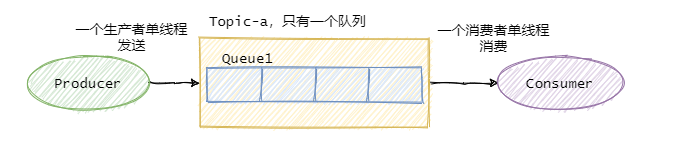
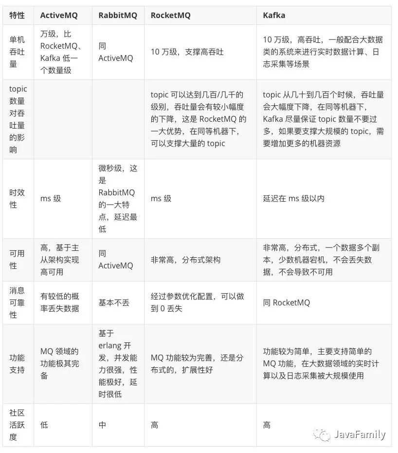
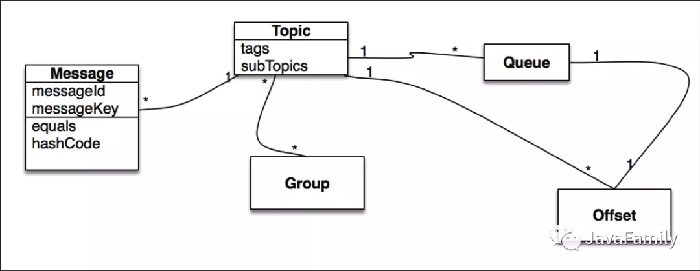

#MQ
    使用场景: 
        1.异步 
            如下单: 扣数据库库存\优惠卷\积分\ 可以通过异步队列去完成 提高接口响应时间
        2.削峰 
            能够抗住高并发, 以至于不会把服务器搞崩, 
        3.解耦
            和下单接口能够分开,实现解耦,以至于不用每次加东西都需要去修改下单的代码,并且不好排查问题
    
    使用消息队列带来的问题
        重复消费: 原因:在消费10个数据，但是在第五个时机器挂了，但是前面5个消费成功了，
                        机器重启后再次消费时，还是从头开始消费，所以导致了重复，可以做幂等
                解决:做消息幂等,强校验和弱校验,强校验如何加GMV和积分的,成功后可以通过一个流水表记录,弱校验可以放在redis的key中
        消息丢失: 原因发送消息，主从切换时，导致消息丢失
                解决:可以通过ack通知客户端，确定主从全部同步了，才返回成功，不然则重试
        消息堆积: 加消费者没有用，一个分区只能对应一个消费者，
             解决: 1.把消费者转发到其他的分区，然后在消费
                   2.可以多建几个分区，那就可以多几个消费者
        消息的顺序消费:
            rocket举例:  MessageQueueSelector队列选择机制 三种实现
                1.我们可使用Hash取模法，让同一个订单发送到同一个队列中，再使用同步发送，当同个订单的创建消息发送成功，再发送支付消息。保证了发送有序。
                2.topic内的队列机制,可以保证存储满足FIFO,剩下的只需要消费者顺序消费即可。
                3.保证顺序发送，顺序消费由消费者业务保证!!!
                
    RabbitMQ 采用队列模型:
        队列模型每条消息只能被一个消费者消费.即使有多个消费者,也只有一个能消费到
    RocketMQ和Kafka 采用发布/订阅模型
        发布/订阅模型可以让一条消息被多个消费者消费，
        当然队列模型也可以通过消息全量存储至多个队列来解决一条消息被多个消费者消费问题，但会有数据冗余。(rabbitMq可以通过交换机实现一个交换机绑定多个路由)
    
    如何保证消息不丢失?
    
        生产消息: 需要处理好Broker的响应，出错情况下利用重试、报警等手段。
        存储消息: 需要控制响应的时机，单机情况下是消息刷盘后返回响应，集群多副本情况下，即发送至两个副本及以上的情况下再返回响应。
        消费消息: 需要在执行完真正的业务逻辑之后再返回响应给Broker。
        以上三种方式可靠性增加,性能就低了,所以也要看业务场景,如果可以丢失几条,就不要再等消息刷盘后再响应
    
    如何保证消息的有序性?
        全局有序: 首先只能由一个生产者往Topic发送消息，并且一个Topic内部只能有一个队列（分区）。消费者也必须是单线程消费这个队列。  
   

        
        部分有序: 
            大部分的有序需求是部分有序，部分有序我们就可以将Topic内部划分成我们需要的队列数，把消息通过特定的策略发往固定的队列中，
            然后每个队列对应一个单线程处理的消费者。这样即完成了部分有序的需求，又可以通过队列数量的并发来提高消息处理效率。
   

    如何处理消息堆积?
        生产者的生产速度与消费者的消费速度不匹配造成消息堆积
        优化方案:
            1.优化下消费逻辑 (多线程之类的,加快执行时间)
            2.水平扩容 增加Topic的队列数和消费者数量，队列数一定要增加，不然新增加的消费者是没东西消费的。一个Topic中，一个队列只会分配给一个消费者。
         
        
        
    
    
    
    技术选型:
        rabbitMq:万级吞吐,时效性微秒级(特性),可用性高,基本不丢失数据
        rocketMq:十万级吞吐,时效性毫秒级,可用性非常高,0丢失
        kafka :十万级吞吐,时效性毫秒,可用性非常高,0丢失
          
   
   
   ###rocketMq
        优点:
            1.单机吞吐量：十万级
            2.可用性：非常高，分布式架构
            3.消息可靠性：经过参数优化配置，消息可以做到0丢失
            4.功能支持：MQ功能较为完善，还是分布式的，扩展性好
            5.支持10亿级别的消息堆积，不会因为堆积导致性能下降
            6.源码是java，我们可以自己阅读源码，定制自己公司的MQ，可以掌控
            7.天生为金融互联网领域而生，对于可靠性要求很高的场景，尤其是电商里面的订单扣款，以及业务削峰，在大量交易涌入时，后端可能无法及时处理的情况
            8.RoketMQ在稳定性上可能更值得信赖，这些业务场景在阿里双11已经经历了多次考验，如果你的业务有上述并发场景，建议可以选择RocketMQ
        缺点:
            1.支持的客户端语言不多，目前是java及c++，其中c++不成熟
            2.社区活跃度不是特别活跃那种
            3.没有在 mq 核心中去实现JMS等接口，有些系统要迁移需要修改大量代码
           
        四大核心组成:
            NameServer: 
                是个功能齐全的服务器,比zookeeper更轻量,NameServer节点互相之间是独立的，没有任何信息交互,主要开销心跳检测和topic-broker
            Broker: 
                消息中转角色，负责存储消息，转发消息。定时将Topic信息注册到NameServer, nameServer的心跳连接和底层通信都是通过netty实现的,
            Producer:
                同步发送(收到接收方回应后,在会继续执行),异步发送(不许等待接收方回应,就会继续执行),单向发送(日志收集)
            Consumer:
                由用户部署，支持PUSH和PULL两种消费模式，支持集群消费和广播消息，提供实时的消息订阅机制。
                
        消息领域模型:
            message:
                要传输的信息,必须有一个主题(topic)
                一条消息也可以拥有一个可选的标签（Tag）和额处的键值对，它们可以用于设置一个业务 Key 并在 Broker 上查找此消息以便在开发期间查找问题。
            Topic:
                可以看做消息的规类一个topic也可以被多个消费者订阅
            Tag:
                可以看作子主题，它是消息的第二级类型,一条消息可以没有tag
            Group:
                分组,一个组可以订阅多个topic,
                分为ProducerGroup，ConsumerGroup，代表某一类的生产者和消费者，一般来说同一个服务可以作为Group，同一个Group一般来说发送和消费的消息都是一样的
            Queue:
                每个Queue内部是有序的，在RocketMQ中分为读和写两种队列，一般来说读写队列数量一致，如果不一致就会出现很多问题。
            Message Queue
                主题被划分为一个或多个子主题，即消息队列。
            Offset:
                所有消息队列都是持久化，长度无限的数据结构，所谓长度无限是指队列中的每个存储单元都是定长，访问其中的存储单元使用Offset 来访问，
                Offset 为 java long 类型，64 位，理论上在 100年内不会溢出，所以认为是长度无限。
        
        分布式事务消息回查：
            
                1.A服务先发送个Half Message给Brock端，消息中携带 B服务 即将要+100元的信息。
                
                2.当A服务知道Half Message发送成功后，那么开始第3步执行本地事务。
                
                3.执行本地事务(会有三种情况1、执行成功。2、执行失败。3、网络等原因导致没有响应)
                
                4.如果本地事务成功，那么Product像Brock服务器发送Commit,这样B服务就可以消费该message。
                
                5.如果本地事务失败，那么Product像Brock服务器发送Rollback,那么就会直接删除上面这条半消息。
                
                6.如果因为网络等原因迟迟没有返回失败还是成功，那么会执行RocketMQ的回调接口,来进行事务的回查。
                
        消息过滤
            1.Broker端消息过滤,按照Consumer的要求做过滤，优点是减少了对于Consumer无用消息的网络传输。缺点是增加了Broker的负担，实现相对复杂。
            2.Consumer端消息过滤,这种过滤方式可由应用完全自定义实现，但是缺点是很多无用的消息要传输到Consumer端。
            
        回溯消费:
            回溯消费是指Consumer已经消费成功的消息，由于业务上的需求需要重新消费,
                Broker在向Consumer投递成功消息后，消息仍然需要保留。并且重新消费一般是按照时间维度。
            
        消息堆积:
            评估消息堆积能力主要有以下四点：
                消息能堆积多少条，多少字节？即消息的堆积容量。
                消息堆积后，发消息的吞吐量大小，是否会受堆积影响？
                消息堆积后，正常消费的Consumer是否会受影响？
                消息堆积后，访问堆积在磁盘的消息时，吞吐量有多大？
        定时消息:
            RocketMQ支持定时消息，但是不支持任意时间精度，支持特定的level，例如定时5s，10s，1m等。
                     
                
        消息消费模式:
            Clustering（集群消费）
                一个队列只会被一个消费者消费，如果某个消费者挂掉，分组内其它消费者会接替挂掉的消费者继续消费。
            Broadcasting（广播消费）
                广播消费消息会发给消费者组中的每一个消费者进行消费。
       Message Order:
            Orderly（顺序消费）
                顺序消费表示消息消费的顺序同生产者为每个消息队列发送的顺序一致，所以如果正在处理全局顺序是强制性的场景，需要确保使用的主题只有一个消息队列。
            Concurrently（并行消费）
                并行消费不再保证消息顺序，消费的最大并行数量受每个消费者客户端指定的线程池限制。
   
            
            
            
            
        