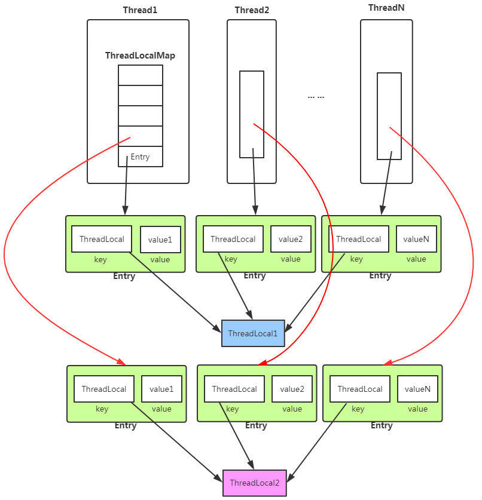

#多线程
   ##synchronized
        偏向锁、偏向锁默认是打开的,但是有4秒的延迟,jvm启动后4s生效   (普通对象, 加锁后变成偏向锁)
            偏向锁的执行效率也不一定比自旋锁效率高,因为有一个锁撤销的过程
        
        轻量级锁、轻量级锁是自旋的,需要消耗大量cpu资源 
            (偏向锁有2个以上竞争的时候就升级为轻量级所 (如果上来就有重度竞争和耗时时长、wait等,则直接升级到重量级锁))
        
        重量级锁: 重量级锁有等待队列,拿不到锁后进入等待队列,不耗cpu资源
            轻量级锁自旋10次后升级重量级锁, 或者等待的线程超过cpu核数的二分之一 (可以通过jvm参数去优化) 不过现在都是自适应自旋, 
            都是jvm自己去判断什么时候升级重量级锁
            
        锁消除: 一个方法中循环调用new StringBuffer(synchronized修饰的方法),不会被其他线程调用,就会把锁消除
                        不可能存在竞争，那么就执行锁消除。锁消除可以节省毫无意义的请求锁的时间。
        
        锁粗化: StringBuffer 循环调用 可以把锁放在循环外面 
        
        
        synchronized 应用在方法上时，在字节码中是通过方法的 ACC_SYNCHRONIZED 标志来实现的。
        synchronized 应用在同步块上时，在字节码中是通过 monitorenter 和 monitorexit 实现的
        以上2者都是 monitor监视器 来实现同步的
        
        
   #####讲一下 synchronized 关键字的底层原理
        synchronized是通过cas实现的 最底层是lock_cmpexgh,
                    包括volatile底层都是lock指令实现的  volatile通过lock add指定,往寄存器上塞个0
           
        synchronzied非原子性,不能阻止指令重排,DCL单例模式容易生成半初始化对象
                
   ##AQS abstractQueuedSynchronizer
        抽象队列同步器框架,提供了一个FIFO的双向链表,是一个用来实现同步锁以及其他涉及到同步功能的核心组件,常见的有:ReentrantLock\CountDownLatch
        
        AQS使用一个可见性的int成员变量来表示同步状态，通过内置的FIFO队列来完成获取资源线程的排队工作。并使用CAS对该同步状态进行原子操作实现对其值的修改。
        
        每个结构的特点是每个数据结构都有两个指针,分别指向前节点和后节点,每个Node由线程封装,当线程抢锁失败后会封装成Node放到AQS\FIFO队列去
        
        AQS是FIFO的队列, 6个操作--》抢锁、释放锁、入队、出队、阻塞、唤醒
        抢锁: state变量0表示没有人拿到锁,拿到锁加1,重入就在加1
                公平和非公平通过构造的入参true和false指定
                优化:看等待区有没有人,如果有,说明被占用,判断方法(hasQueuePredecessors)
               aqs队列生成2个节点,普通的队列生成一个节点
        释放锁: 重入问题,state恢复为0,唤醒队列中等待的线程
        入队:
                 入队后队列中的第二个节点再次抢锁、上闹钟、阻塞
        出队:
        
   #####AQS定义两种资源共享方式
        1.Exclusive（独占）：只有一个线程能执行，如ReentrantLock。又可分为公平锁和非公平锁：
              公平锁：按照线程在队列中的排队顺序，先到者先拿到锁
              非公平锁：当线程要获取锁时，无视队列顺序直接去抢锁，谁抢到就是谁的
        2.Share（共享）：多个线程可同时执行，
              如Semaphore/CountDownLatch/CyclicBarrier/ReadWriteLock 
              
   ##什么是线程安全?
        与其说线程安全,不如说内存安全,在堆内存中的数据由于可以被任何线程访问到，在没有限制的情况下存在被意外修改的风险.
        即堆内存空间在没有保护机制的情况下，对多线程来说是不安全的地方，因为你放进去的数据，可能被别的线程“破坏”。
   
   ##CAS 
        1. 是乐观锁的一种实现方式，是一种轻量级锁,
        2. 容易发生ABA问题,需要进行值和版本号比较(compare and swap 只比较值)
        3. CAS操作长时间不成功的话，会导致一直自旋，相当于死循环了，CPU的压力会很大。
        
        1.cas是一种自旋锁,非原子性的, 所以最终底层是通过lock cmpxchg指定实现, 硬件方面: lock指令在执行后面指令的时候锁定一个北桥信号
        
   ##volatile
       volatile 保持线程可见性, 每次都去主内存中去读数据,防止指令重排 (lock addl指令)
       as-if-serial  不管怎么重排序，单线程下的执行结果不能被改变。
       happens-before 有哪些指令不可以重排序 jvm规定重排序必须遵守的规则
       volatile的可见性, --》缓存一致性协议(MESI) cpu的每个核都有自己的一级和二级缓存,三级缓存是每2个核共享一个三级缓存,
           读取数据的时候会去读取一个64字节的缓存行, 这个缓存行有4种状态 (修改、独占、共享、失效) 如果进行了修改,缓存行就会失效,
           则会通知其他cpu重新去内存中读
   
        MESI（缓存一致性协议）   
            当CPU写数据时，如果发现操作的变量是共享变量，即在其他CPU中也存在该变量的副本，会发出信号通知其他CPU将该变量的缓存行置为无效状态，
                因此当其他CPU需要读取这个变量时，发现自己缓存中缓存该变量的缓存行是无效的，那么它就会从内存重新读取。
        通过嗅探发现数据是否失效.
       
        内存屏障: 
            LoadLoad屏障：对于这样的语句Load1; LoadLoad; Load2，在Load2及后续读取操作要读取的数据被访问前，保证Load1要读取的数据被读取完毕。
            StoreStore屏障：对于这样的语句Store1; StoreStore; Store2，在Store2及后续写入操作执行前，这个屏障会吧Store1强制刷新到内存，
                保证Store1的写入操作对其它处理器可见。
            LoadStore屏障：对于这样的语句Load1; LoadStore; Store2，在Store2及后续写入操作被刷出前，保证Load1要读取的数据被读取完毕。
            StoreLoad屏障：对于这样的语句Store1; StoreLoad; Load2，在Load2及后续所有读取操作执行前，保证Store1的写入对所有处理器可见。
                它的开销是四种屏障中最大的（冲刷写缓冲器，清空无效化队列）。在大多数处理器的实现中，这个屏障是个万能屏障，兼具其它三种内存屏障的功能
        
        
        
        
        
   ##ThreadLocal
        线程本地副本变量
        使用场景: 
            1.spring采用ThreadLocal的方式来保证单个线程中的数据库操作是同一个数据库连接 详见:TransactionSynchronizationManager类
            2.simpleDateFormat: 多线程环境下会出现线程安全性问题, 内部有一个Calendar类,如果调用了add和clear方法后,parse方法就出问题了
        底层实现原理;
            1.每个线程都有ThreadLocals属性 , 是一个ThreadLocalMap,存放着线程的本地数据,从而实现了数据隔离
            2.ThreadLocalMap底层实现:
                类似于hashMap,但是他是基于数组和非链表的形式
                数组是因为一个线程中可能有多个ThreadLocal,即多个本地变量
                解决hash冲突: 
                    在插入过程中，根据ThreadLocal对象的hash值，定位到table中的位置i
                    如果当前位置是空的，就初始化一个Entry对象放在位置i上；
                    如果位置i不为空，如果这个Entry对象的key正好是即将设置的key，那么就刷新Entry中的value；
                    如果位置i的不为空，而且key不等于entry，那就找下一个空位置，直到为空为止。
            3.本地变量存放在哪里?
                虽然每个线程都会有一个属于自己的栈内存,但是都是位于堆上,只是通过一些技巧将可见性修改成了线程可见
                
        InheritableThreadLocal可以共享线程ThreadLocal数据,但是只能在子线程中
            (Thread类中有InheritableThreadLocals属性)          
            
        导致内存泄漏: ThreadLocalMap的key是弱引用会被垃圾回收,但是value是强引用(可能value被其他所引用着,所以不能直接设置为弱引用)
            ,永远不会被回收,会导致OOM,用完必须remove掉ThreadLocal变量
            ThreadLocalMap的key设置成弱引用也是为了避免OOM
            
      
        
        
        
        
        
        
        
        
            
   
  