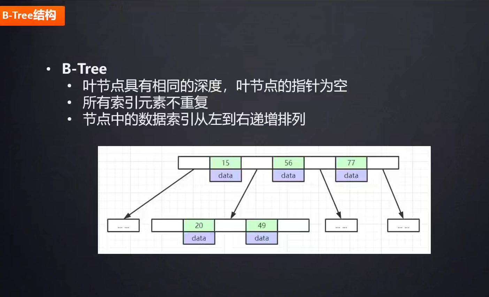

#Mysql
   ###mysql架构
        1.客户端:jdbc,navicat,sqlyog
        2.服务层:连接器\解析器\优化器\执行器
        3.执行引擎:innodb\myisam
   ###sql调优
        优化器对于mysql是CBO（基于代价的优化器），对于oracle是RBO（基于规则的优化器）
        总结: 1.慢查询的开启并捕获
              2.explain+慢sql分析
              3.show profile查询sql在mysql服务器里面的执行细节和生命周期情况
              4.sql数据库服务器的参数调优
        

        DBA建议
              1,不要在条件列上应用表达式，以免使用不了该列上的索引。
              2.不要在条件的赋值上发生隐式转换，以免使用不了该列上的索引。
              3.时间列如果要判断为某一天改用BETWEEN-AND.方式。
              4.时间列条件的跨度越短越好，减少返回的行数，
              5.如果是后台任务，分页查询，那么分页的大小尽可能的大一些，减少查询次数。或者加上条件 id ＞上次分页取到的最大ID。
   
        1.排除缓存干扰
            加上SQL NoCache去跑sql
        2.explain计划:
            1.id
                包含一组数字，表示查询中执行select子句或操作表的顺序
                
                id值越大优先级越高，越先被执行,id相同，执行顺序由上至下
            2.select_type
                示查询中每个select子句的类型（简单OR复杂）
                
                a. SIMPLE：查询中不包含子查询或者UNION
                b. 查询中若包含任何复杂的子部分，最外层查询则被标记为：PRIMARY
                c. 在SELECT或WHERE列表中包含了子查询，该子查询被标记为：SUBQUERY
                d. 在FROM列表中包含的子查询被标记为：DERIVED（衍生）用来表示包含在from子句中的子查询的select，mysql会递归执行并将结果放到一个临时表中。
                    服务器内部称为"派生表"，因为该临时表是从子查询中派生出来的
                e. 若第二个SELECT出现在UNION之后，则被标记为UNION；若UNION包含在FROM子句的子查询中，外层SELECT将被标记为：DERIVED
                f. 从UNION表获取结果的SELECT被标记为：UNION RESULT
                
                SUBQUERY和UNION还可以被标记为DEPENDENT和UNCACHEABLE。
                DEPENDENT意味着select依赖于外层查询中发现的数据。
                UNCACHEABLE意味着select中的某些 特性阻止结果被缓存于一个item_cache中。
                
            3.type :  
                从左到右，性能从最差到最好
                ALL：Full Table Scan， MySQL将遍历全表以找到匹配的行
                index:  Full Index Scan，index与ALL区别为index类型只遍历索引树
                range: 索引范围扫描，对索引的扫描开始于某一点，返回匹配值域的行。显而易见的索引范围扫描是带有between或者where子句里带有<, >查询。
                        当mysql使用索引去查找一系列值时，例如IN()和OR列表，也会显示range（范围扫描）,当然性能上面是有差异的。
                ref:    使用非唯一索引扫描或者唯一索引的前缀扫描，返回匹配某个单独值的记录行
                eq_ref: 类似ref，区别就在使用的索引是唯一索引，对于每个索引键值，表中只有一条记录匹配，简单来说，
                        就是多表连接中使用primary key或者 unique key作为关联条件
                const:  当MySQL对查询某部分进行优化，并转换为一个常量时，使用这些类型访问。如将主键置于where列表中，MySQL就能将该查询转换为一个常量
                        例:select * from table where id = 1
                system: system是const类型的特例，当查询的表只有一行的情况下，使用system
                NULL:   MySQL在优化过程中分解语句，执行时甚至不用访问表或索引，例如从一个索引列里选取最小值可以通过单独索引查找完成。
           
            4.possible_keys
                指出MySQL能使用哪个索引在表中找到记录，查询涉及到的字段上若存在索引，则该索引将被列出，但不一定被查询使用
            5.key
                显示MySQL在查询中实际使用的索引，若没有使用索引，显示为NULL
            6.key_len
                表示索引中使用的字节数，可通过该列计算查询中使用的索引的长度（key_len显示的值为索引字段的最大可能长度，并非实际使用长度，即key_len是根据表定义计算而得，不是通过表内检索出的）
            7.ref
                表示上述表的连接匹配条件，即哪些列或常量被用于查找索引列上的值
            8.rows
                表示MySQL根据表统计信息及索引选用情况，估算的找到所需的记录所需要读取的行数
            9. Extra
                包含不适合在其他列中显示但十分重要的额外信息
                (1) Using filesort
                    这种情况是在使用 order by 关键字的时候，如果待排序的内容无法通过索引直接直接进行排序，mysql就有可能进行文件排序。
                    当然不是说出现了此情况就会对sql语句的效率造成影响。但是由于查询次数过多的话，对于排序的效率还是有一定的影响的。
                    可以通过设置 max_length_for_sort_data 来 提高 order by 的效率。
                    如果操作的数据大小高于max_length_for_sort_data 的缓存大小时，mysql会产生临时表进行查询，一定程度上会影响效率。 max_length_for_sort_data的默认值是1024。
                    优化方案：
                        优化业务逻辑，不使用 order by ，而在业务代码中执行排序方法
                        设置索引，将带排序的内容放在索引中，直接利用索引进行排序
                (2) using temporary 
                    性能损耗大 ，用到了临时表。一般出现在group by 语句中。
                (3) impossible where
                    这个表示where子句永远为false
                (3) Using index
                    使用索引，表示索引能够覆盖所有的查询字段,无需进行回表查询所以效率会高。大部分情况代表最优
                (4) Using where 单独出现
                    表示当前查询的字段不能被索引覆盖，所以可能会产生回表，效率比前者低
                (5) Using where;Using index
                    表示查询的列被索引覆盖，且where筛选条件是索引列前导列的一个范围，或者是索引列的非前导列。 效率也比较高
                (6) null
                    表示查询的列未被索引覆盖，且where筛选条件是索引的前导列，这意味着用到了索引，但是部分字段未被索引覆盖，必须通过“回表查询”来实现，因而性能也比前两者差。
                (7) Using index condition
                    表示查询条件中虽然出现了索引列，但是有部分条件无法使用索引，会根据能用索引的条件先搜索一遍再匹配无法使用索引的条件。
                
        3. 覆盖索引
            在自己的索引上就查到自己想要的，不要去主键索引查了。
        4.联合索引
            例: 查询商品名字和库存,名称和库存的联合索引，这样名称查出来就可以看到库存了，不需要查出id之后去回表再查询库存了
        5.最左匹配原则
            例: 模糊查询 name like '敖丙%',左边不加%号会走索引
        6.索引下推
            select * from table where name like '敖%' and size=22 and age = 20;
            改成
            select * from (select id,name from table where size=22 and age = 20) a where a.name like '熬%';
        7.前缀索引
            可以定义字符串的一部分作为索引
        8.条件字段函数操作
             select * from tradelog where id + 1 = 10000 就走不上索引
             select * from tradelog where id = 9999就可以。
        9.唯一索引
            默认B+树的索引实现
   ###mysql 索引
        聚簇索引: 主要体现在innoDB的存储引擎,就是主键,没有主键找非空的唯一索引,没有再找6个字节的rowid(对用户无感知),
                    并且会和数据一起存放在叶子节点里面
        非聚簇索引: MyISAM的存储引擎, 叶子节点只存放地址,不存放数据
        回表查询: 索引的那棵树上没有需要的字段,只能根据id,在去查询主键那棵树查询,这个过程称之为回表.
        最左匹配: 比如like关键字,只能以什么什么开头才可以走索引,不然不好匹配.
                  比如组合索引,是有顺序的,只能从左依次到右查询索引树,不能够反方向.
        索引下推: 
        索引覆盖: 可以避免回表,把要查询的字段定义成一个组合索引,防止了回表,说白了就是在索引的那棵树下的数据包含了需要select出来的数据
        
        B+树: 根节点,非叶子节点,叶子节点,叶子节点是双向链表,并且查询方式有两种,一种是从根节点查询,一种是从叶子节点遍历.
              B+树的主键树是自增的,如果不自增,不有序,有导致页分裂,页合并
        B-树: 根节点,非叶子节点,叶子节点, 每个非叶子节点下面的叶子节点是隔离的,没有做连接
   ####索引优缺点
        优点: 加快查询、唯一索引可以保证数据唯一
        缺点：创建费时、更新时需要维护、占用磁盘的空间
   
   ####事务
        A:原子性:要么成功要么失败,undolog保证
        C:一致性:通过AID和客户端所保证
        I:隔离性:数据互不影响,mvcc保证
        D:持久性:事务提交,则永远保存再磁盘,redolog保证
         
   ###隔离级别
        1.读未提交
        2.读已提交 mvcc实现
        3.可重复读 mvcc实现
        4.串行化 间隙锁(幻读)
        
        脏读: 其他事务还没有提交的事务被读了出来
        不可重复读: 两次查询,中间有事务进行了修改操作,读出来的不一样
            在 InnoDB 存储引擎中，SELECT 操作的不可重复读问题通过 MVCC 得到了解决，
            而 UPDATE、DELETE 的不可重复读问题通过 Record Lock 解决，
            INSERT 的不可重复读问题是通过 间隙锁Next-Key Lock（Record Lock + Gap Lock）解决的。
            解决方式: MVCC, 快照读,readview
        幻读: 两次查询,中间有事务进行了增加操作,读出来的数据变多了,
                解决方式:间隙锁
        
   ###Buffer Pool
        MySQL以「页」为单位从磁盘读取数据的，Buffer Pool也是，实际上Buffer Pool 是一个以页为元素的链表(基于LRU算法来管理)
   ###Change Buffer
         MySQL发现你要修改的页，不在内存里，就先记到Change Buffer，同时记录 redo log，然后再慢慢把数据记载到内存，
            加载过来后，再把 Change Buffer 里记录的修改，应用到内存（Buffer Pool）中，这个动作叫做 merge；
                而把内存数据刷到磁盘的动作，叫 purge
   ###Mysql死锁问题
        （1）查看死锁日志 show engine innodb status; 
        （2）找出死锁Sql 
        （3）分析sql加锁情况 
        （4）模拟死锁案发 
        （5）分析死锁日志 
        （6）分析死锁结果
   ###Mysql主从
        主从复制是指将主数据库的DDL和DML操作通过二进制日志传到从数据库上，然后在从数据库上对这些日志进行重新执行，
            从而使从数据库和主数据库的数据保持一致。
        
   ###主从复制的原理     
        1.MySql主库在事务提交时会把数据变更作为事件记录在二进制日志Binlog中；
        2.主库推送二进制日志文件Binlog中的事件到从库的中继日志Relay Log中，之后从库根据日志中继重做数据变更操作，
            通过逻辑复制来达到主库和从库的数据一致性；
        3.MySql通过三个线程来完成主从库间的数据复制，其中Binlog Dump线程跑在主库上，I/O线程和SQL线程跑着从库上；
        4.当在从库上启动复制时，首先创建I/O线程连接主库，主库随后创建Binlog Dump线程读取数据库事件并发送给I/O线程，
            I/O线程获取到事件数据后更新到从库的中继日志Relay Log中去，之后从库上的SQL线程读取中继日志Relay Log中更新的数据库事件并应用，如下图所示。
        
        如何保证主从复制时的数据不丢失?
            1.半同步复制，用来解决主库数据丢失问题
                也叫 semi-sync 复制，指的就是主库写入 binlog 日志之后，就会将强制此时立即将数据同步到从库，从库将日志写入自己本地的 relay log 之后，接着会返回一个 ack 给主库，
                    主库接收到至少一个从库的 ack 之后才会认为写操作完成了。
            2.并行复制，用来解决主从同步延时问题。  (主从复制时串行化的)
                所谓并行复制，指的是从库开启多个线程，并行读取 relay log 中不同库的日志，然后并行重放不同库的日志，这是库级别的并行。
                1.分库，将一个主库拆分为多个主库，每个主库的写并发就减少了几倍，此时主从延迟可以忽略不计。
                2.打开 MySQL 支持的并行复制，多个库并行复制。如果说某个库的写入并发就是特别高，单库写并发达到了 2000/s，并行复制还是没意义。
               
  
  
  ###MYSQL的主从延迟，你怎么解决？
          原因：一个mysql会由多个客户端连接，但是读取binlog的线程只有一个，如某个sql执行时间较长或有行锁，则主库就会堆积，导致了主从延迟
          原因：sql thread从re ley 1og里面从数据的时候是随机读写，所以会导致延迟,但是到binlog和reley 1og 都是有序读写的.
            二阶段提交先写regolog 此时是prepare状态，再写binlog，然后在commit提交事务
          解决办法：
                1.增加从服务器，也可以把一台从服务器当度作为备份使用，而不提供查询，那边他的负载下来了，执行relay log 里面的SQL效率自然就高了
                2.5.7版本之后（MTS-组提交)可以解决？

  ###为什么要分库分表?
        数据库出现性能瓶颈
        1.高井发大量请求阳塞，连接数受限
        2.S0L 操作变慢，数据量大到了一定的程度，全表扫描就很难
        3.存储出现问题，数据越来越多
        优化方案
            新增机器
            调优、表结构优化、读写分离、数据库集群、分库分表等

        自增ID达到上限用完了之后，分为两种情况：
            1.有主锥，那么将会报错主键冲突，
            2.没有主键，数据库自动生成一个全局的row_ id，新数据会覆盖老数据
  ###分区
        概念:就是把一张表的数据分成N个区块，在逻辑上看最终只是一张表，但底层是由N个物理区块组成的(不同的磁盘)
        作用: 提升查询效率
        水平分区: 10年的记录,把他分成一年一分区
        垂直分区: 表中有text类型字段,并不经常使用,可以把这个字段独立出去.
        什么情况下分区?
            表数据量过大,查询慢,并且常用的只是某一部分的数据,不是全表
  
  ###分表
          概念:就是把一张表按一定的规则分解成N个具有独立存储空间的实体表。系统读写时需要根据定义好的规则得到对应的字表明，然后操作它。         
          作用: 查询快,磁盘IO性能提高,读写锁影响的数据量变小,
          什么情况下分表?
              大数据量大,频繁插入或者联合查询时,速度慢
  
  ###分库
        概念:一旦分表，一个库中的表会越来越多,就需要多个库
        作用: 其主要目的是为突破单节点数据库服务器的 I/O 能力限制，解决数据库扩展性问题。
        水平拆分: 按照规则划分，一般水平分库是在垂直分库之后的。比如每天处理的订单数量是海量的，
                  可以按照一定的规则水平划分。需要解决的问题：数据路由、组装。
        垂直拆分: 将系统中不存在关联关系或者需要join的表可以放在不同的数据库不同的服务器中。
                  按照业务垂直划分。比如：可以按照业务分为资金、会员、订单三个数据库。
        
        什么情况下考虑分库?
            1.单台DB的存储空间不够
            2.随着查询量的增加单台数据库服务器已经没办法支撑
        
        读写分离:
            对于时效性不高的数据，可以通过读写分离缓解数据库压力。需要解决的问题：在业务上区分哪些业务上是允许一定时间延迟的，
            以及数据同步问题。
         
        思路:垂直分库-->水平分库-->读写分离
  
  ###拆分之后面临新的问题
      1.事务的支持，分库分表，就变成了分布式事务
      2.join时跨库，跨表的问题
      3.分库分表，读写分离使用了分布式，分布式为了保证强一致性，必然带来延迟，导致性能降低，系统的复杂度变高。
         常用的解决方案
            选用第三方的数据库中间件（Atlas，Mycat，TDDL，DRDS），同时业务系统需要配合数据存储的升级。
      
  ###分区分表的规则策略
        1.Range（范围）
        2.Hash（哈希）
        3.按照时间拆分
        4.Hash之后按照分表个数取模
        5.在认证库中保存数据库配置，就是建立一个DB，这个DB单独保存user_id到DB的映射关系
        
  ###分库分表
        1.如何把未分库分表动态切换到分库分表上?
            1.双写迁移方案
                除了对老库增删改，都加上对新库的增删改，这就是所谓的双写，同时写俩库，老库和新库。
                然后系统部署之后，新库数据差太远，用之前说的导出工具，跑起来读老库数据写新库，
                写的时候要根据 gmt_modified 这类字段判断这条数据最后修改的时间，除非是读出来的数据在新库里没有，
                或者是比新库的数据新才会写。简单来说，就是不允许用老数据覆盖新数据。
        
        2.如何设计可以动态扩容缩容的分库分表方案？
            1.设定好几台数据库服务器，每台服务器上几个库，每个库多少个表，推荐是 32 库 * 32 表，对于大部分公司来说，可能几年都够了。
            2.路由的规则，orderId 模 32 = 库，orderId / 32 模 32 = 表
            3.扩容的时候，申请增加更多的数据库服务器，装好 MySQL，呈倍数扩容，4 台服务器，扩到 8 台服务器，再到 16 台服务器。
            4.由 DBA 负责将原先数据库服务器的库，迁移到新的数据库服务器上去，库迁移是有一些便捷的工具的。
            5.我们这边就是修改一下配置，调整迁移的库所在数据库服务器的地址。
            6.重新发布系统，上线，原先的路由规则变都不用变，直接可以基于 n 倍的数据库服务器的资源，继续进行线上系统的提供服务。
  
  ###MVCC
        多版本并发控制：
            MVCC 在 MySQL InnoDB 中的实现主要是为了提高数据库并发性能，
            用更好的方式去处理读-写冲突，做到即使有读写冲突时，也能做到不加锁，非阻塞并发读
            
            1-隐藏字段：db_trx_id 记录创建当前记录或者最后一个修改的事务id
                        db_roll_ptr 回滚指针，指向上一个版本
                        db_row_id 隐藏主键
            2.undolog:生成一个链表，参考隐藏字段的db_roll_ptr，可以回滚到具体哪个版本
                    purge线程会清理undolog日志
            3.readview：当事务在进行快照读的时候，会生成一个读视图来进行可见性判断(可见性算法来确定）
                trx list：当前系统活跃的事务id
                up_Limit_id 活跃事务列表中最小的id值
                low_Limit id 当前系统尚未分配的下一个事务id
            
            mvcc可能会出现幻读，幻读需要间隙锁来保证
            间隙锁危害: 如果他锁定了一个范围,这个范围内就算不存在的值也会被锁定,那么就没办法插入了,所以对性能会造成很大的危害
            当前读：就是它读取的是记录的最新版本，读取时还要保证其他并发事务不能修改当前记录，会对读取的记录进行加锁
            快照读：即快照读可能读到的并不一定是数据的最新版本，而有可能是之前的历史版本
  ###MySQL数据库cpu飙升的话，要怎么处理呢？
        排查：
            （1）使用top 命令观察，确定是mysqld导致还是其他原因。
            （2）如果是mysqld导致的，show processlist，查看session情况，确定是不是有消耗资源的sql在运行。
            （3）找出消耗高的 sql，看看执行计划是否准确， 索引是否缺失，数据量是否太大。
             大量的 session 连进来导致 cpu 飙升
        处理：
            （1）kill 掉这些线程(同时观察 cpu 使用率是否下降)， 
            （2）进行相应的调整(比如说加索引、改 sql、改内存参数) （3）重新跑这些 SQL。

  ###MySQL log
        undo log 
            回滚和多版本控制(MVCC),保证了原子性
            insert一条数据了，那undo log会记录的一条对应的delete日志。
            update一条记录时，它会记录一条对应相反的update记录。
            
        binlog : 
            1.记录了数据库表结构和表数据变更,比如增删改等
            2.复制和恢复数据
        
        redo log (innoDB引擎才有):
            mysql修改行,会先写在内存中,然后在写到磁盘中,如果写磁盘的过程中数据库挂了,就用到了redo log, redo log是记录修改的内容的
            并且用到了NIO,恢复速度快.
        
        要保证binlog和redolog一致:
            二阶段提交: 先写入redolog,但是是prepare提交状态,这时候写入binlog,提交事务处于commit状态
            
  ###数据结构
        //https://www.cs.usfca.edu/~galles/visualization/Algorithms.html
        二叉树
        红黑树:又称二叉平衡树,由二叉树演变而来,再插入后,会左右平衡
        

        B树:由非叶子节点和叶子节点构成,本来节点只有一个数据,现在变成一个数组
    

        B+树:叶子节点存储数据,非叶子节点不存储,叶子节点和非叶子节点的索引冗余,节点的双向指针

  ###面试问题
        count (1) count(*)
        5.6版本以后是没有太大的区别的
        如果该表只有一个主键索引，没有任何二级索引的情况下，那么COUNT(*)和COUNT(1）都是通过通过主键索引l来统计行数的。
        如果该表有二级索引，则COUNT(1)和COUNT(*)都会通过占用空间最小的字段的二级索引进行统计。

  
        
        
            