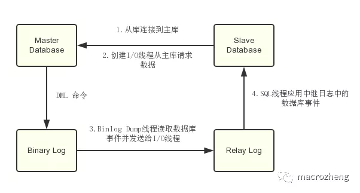

#Mysql
   ###sql调优
        1.排除缓存干扰
            加上SQL NoCache去跑sql
        2.explain计划:
            1.id
                包含一组数字，表示查询中执行select子句或操作表的顺序
                
                id值越大优先级越高，越先被执行,id相同，执行顺序由上至下
            2.select_type
                示查询中每个select子句的类型（简单OR复杂）
                
                a. SIMPLE：查询中不包含子查询或者UNION
                b. 查询中若包含任何复杂的子部分，最外层查询则被标记为：PRIMARY
                c. 在SELECT或WHERE列表中包含了子查询，该子查询被标记为：SUBQUERY
                d. 在FROM列表中包含的子查询被标记为：DERIVED（衍生）用来表示包含在from子句中的子查询的select，mysql会递归执行并将结果放到一个临时表中。
                    服务器内部称为"派生表"，因为该临时表是从子查询中派生出来的
                e. 若第二个SELECT出现在UNION之后，则被标记为UNION；若UNION包含在FROM子句的子查询中，外层SELECT将被标记为：DERIVED
                f. 从UNION表获取结果的SELECT被标记为：UNION RESULT
                
                SUBQUERY和UNION还可以被标记为DEPENDENT和UNCACHEABLE。
                DEPENDENT意味着select依赖于外层查询中发现的数据。
                UNCACHEABLE意味着select中的某些 特性阻止结果被缓存于一个item_cache中。
                
            3.type :  
                从左到右，性能从最差到最好
                ALL：Full Table Scan， MySQL将遍历全表以找到匹配的行
                index:  Full Index Scan，index与ALL区别为index类型只遍历索引树
                range: 索引范围扫描，对索引的扫描开始于某一点，返回匹配值域的行。显而易见的索引范围扫描是带有between或者where子句里带有<, >查询。
                        当mysql使用索引去查找一系列值时，例如IN()和OR列表，也会显示range（范围扫描）,当然性能上面是有差异的。
                ref:    使用非唯一索引扫描或者唯一索引的前缀扫描，返回匹配某个单独值的记录行
                eq_ref: 类似ref，区别就在使用的索引是唯一索引，对于每个索引键值，表中只有一条记录匹配，简单来说，
                        就是多表连接中使用primary key或者 unique key作为关联条件
                const:  当MySQL对查询某部分进行优化，并转换为一个常量时，使用这些类型访问。如将主键置于where列表中，MySQL就能将该查询转换为一个常量
                system: system是const类型的特例，当查询的表只有一行的情况下，使用system
                NULL:   MySQL在优化过程中分解语句，执行时甚至不用访问表或索引，例如从一个索引列里选取最小值可以通过单独索引查找完成。
           
            4.possible_keys
                指出MySQL能使用哪个索引在表中找到记录，查询涉及到的字段上若存在索引，则该索引将被列出，但不一定被查询使用
            5.key
                显示MySQL在查询中实际使用的索引，若没有使用索引，显示为NULL
            6.key_len
                表示索引中使用的字节数，可通过该列计算查询中使用的索引的长度（key_len显示的值为索引字段的最大可能长度，并非实际使用长度，即key_len是根据表定义计算而得，不是通过表内检索出的）
            7.ref
                表示上述表的连接匹配条件，即哪些列或常量被用于查找索引列上的值
            8.rows
                表示MySQL根据表统计信息及索引选用情况，估算的找到所需的记录所需要读取的行数
            9. Extra
                包含不适合在其他列中显示但十分重要的额外信息
                
        3. 覆盖索引
            在自己的索引上就查到自己想要的，不要去主键索引查了。
        4.联合索引
            例: 查询商品名字和库存,名称和库存的联合索引，这样名称查出来就可以看到库存了，不需要查出id之后去回表再查询库存了
        5.最左匹配原则
            例: 模糊查询 name like '敖丙%',左边不加%号会走索引
        6.索引下推
            select * from table where name like '敖%' and size=22 and age = 20;
            改成
            select * from (select id,name from table where size=22 and age = 20) a where a.name like '熬%';
        7.前缀索引
            可以定义字符串的一部分作为索引
        8.条件字段函数操作
             select * from tradelog where id + 1 = 10000 就走不上索引
             select * from tradelog where id = 9999就可以。
        9.唯一索引
            默认B+树的索引实现
   ###mysql 索引
        聚簇索引: 主要体现在innoDB的存储引擎,就是主键,没有主键找非空的唯一索引,没有再找6个字节的rowid(对用户无感知),
                    并且会和数据一起存放在叶子节点里面
        非聚簇索引: MyISAM的存储引擎, 叶子节点只存放地址,不存放数据
        回表查询: 索引的那棵树上没有需要的字段,只能根据id,在去查询主键那棵树查询,这个过程称之为回表.
        最左匹配: 比如like关键字,只能以什么什么开头才可以走索引,不然不好匹配.
                  比如组合索引,是有顺序的,只能从左依次到右查询索引树,不能够反方向.
        索引下推: 
        索引覆盖: 可以避免回表,把要查询的字段定义成一个组合索引,防止了回表,说白了就是在索引的那棵树下的数据包含了需要select出来的数据
        
        B+树: 根节点,非叶子节点,叶子节点,叶子节点是双向链表,并且查询方式有两种,一种是从根节点查询,一种是从叶子节点遍历.
              B+树的主键树是自增的,如果不自增,不有序,有导致页分裂,页合并
        B-树: 根节点,非叶子节点,叶子节点, 每个非叶子节点下面的叶子节点是隔离的,没有做连接
            
            
   ###隔离级别
        1.读未提交
        2.读已提交
        3.可重复读
        4.串行化
        
        脏读: 其他事务还没有提交的事务被读了出来
        不可重复读: 两次查询,中间有事务进行了修改操作,读出来的不一样
        幻读: 两次查询,中间有事务进行了增加操作,读出来的数据变多了
   
   ###Mysql主从
        主从复制是指将主数据库的DDL和DML操作通过二进制日志传到从数据库上，然后在从数据库上对这些日志进行重新执行，
            从而使从数据库和主数据库的数据保持一致。
        
   ###主从复制的原理     
        1.MySql主库在事务提交时会把数据变更作为事件记录在二进制日志Binlog中；
        2.主库推送二进制日志文件Binlog中的事件到从库的中继日志Relay Log中，之后从库根据中继日志重做数据变更操作，
            通过逻辑复制来达到主库和从库的数据一致性；
        3.MySql通过三个线程来完成主从库间的数据复制，其中Binlog Dump线程跑在主库上，I/O线程和SQL线程跑着从库上；
        4.当在从库上启动复制时，首先创建I/O线程连接主库，主库随后创建Binlog Dump线程读取数据库事件并发送给I/O线程，
            I/O线程获取到事件数据后更新到从库的中继日志Relay Log中去，之后从库上的SQL线程读取中继日志Relay Log中更新的数据库事件并应用，如下图所示。
        
        如何保证主从复制时的数据不丢失?
            1.半同步复制，用来解决主库数据丢失问题
                也叫 semi-sync 复制，指的就是主库写入 binlog 日志之后，就会将强制此时立即将数据同步到从库，从库将日志写入自己本地的 relay log 之后，接着会返回一个 ack 给主库，
                    主库接收到至少一个从库的 ack 之后才会认为写操作完成了。
            2.并行复制，用来解决主从同步延时问题。  (主从复制时串行化的)
                所谓并行复制，指的是从库开启多个线程，并行读取 relay log 中不同库的日志，然后并行重放不同库的日志，这是库级别的并行。
                1.分库，将一个主库拆分为多个主库，每个主库的写并发就减少了几倍，此时主从延迟可以忽略不计。
                2.打开 MySQL 支持的并行复制，多个库并行复制。如果说某个库的写入并发就是特别高，单库写并发达到了 2000/s，并行复制还是没意义。
               
  
  
  ###分区
        概念:就是把一张表的数据分成N个区块，在逻辑上看最终只是一张表，但底层是由N个物理区块组成的(不同的磁盘)
        作用: 提升查询效率
        水平分区: 10年的记录,把他分成一年一分区
        垂直分区: 表中有text类型字段,并不经常使用,可以把这个字段独立出去.
        什么情况下分区?
            表数据量过大,查询慢,并且常用的只是某一部分的数据,不是全表
  
  ###分表
          概念:就是把一张表按一定的规则分解成N个具有独立存储空间的实体表。系统读写时需要根据定义好的规则得到对应的字表明，然后操作它。         
          作用: 查询快,磁盘IO性能提高,读写锁影响的数据量变小,
          什么情况下分表?
              大数据量大,频繁插入或者联合查询时,速度慢
  
  ###分库
        概念:一旦分表，一个库中的表会越来越多,就需要多个库
        作用: 其主要目的是为突破单节点数据库服务器的 I/O 能力限制，解决数据库扩展性问题。
        水平拆分: 按照规则划分，一般水平分库是在垂直分库之后的。比如每天处理的订单数量是海量的，
                  可以按照一定的规则水平划分。需要解决的问题：数据路由、组装。
        垂直拆分: 将系统中不存在关联关系或者需要join的表可以放在不同的数据库不同的服务器中。
                  按照业务垂直划分。比如：可以按照业务分为资金、会员、订单三个数据库。
        
        什么情况下考虑分库?
            1.单台DB的存储空间不够
            2.随着查询量的增加单台数据库服务器已经没办法支撑
        
        读写分离:
            对于时效性不高的数据，可以通过读写分离缓解数据库压力。需要解决的问题：在业务上区分哪些业务上是允许一定时间延迟的，
            以及数据同步问题。
         
        思路:垂直分库-->水平分库-->读写分离
  
  ###拆分之后面临新的问题
      1.事务的支持，分库分表，就变成了分布式事务
      2.join时跨库，跨表的问题
      3.分库分表，读写分离使用了分布式，分布式为了保证强一致性，必然带来延迟，导致性能降低，系统的复杂度变高。
         常用的解决方案
            选用第三方的数据库中间件（Atlas，Mycat，TDDL，DRDS），同时业务系统需要配合数据存储的升级。
      
  ###分区分表的规则策略
        1.Range（范围）
        2.Hash（哈希）
        3.按照时间拆分
        4.Hash之后按照分表个数取模
        5.在认证库中保存数据库配置，就是建立一个DB，这个DB单独保存user_id到DB的映射关系
        
  ###分库分表
        1.如何把未分库分表动态切换到分库分表上?
            1.双写迁移方案
                除了对老库增删改，都加上对新库的增删改，这就是所谓的双写，同时写俩库，老库和新库。
                然后系统部署之后，新库数据差太远，用之前说的导出工具，跑起来读老库数据写新库，
                写的时候要根据 gmt_modified 这类字段判断这条数据最后修改的时间，除非是读出来的数据在新库里没有，
                或者是比新库的数据新才会写。简单来说，就是不允许用老数据覆盖新数据。
        
        2.如何设计可以动态扩容缩容的分库分表方案？
            1.设定好几台数据库服务器，每台服务器上几个库，每个库多少个表，推荐是 32 库 * 32 表，对于大部分公司来说，可能几年都够了。
            2.路由的规则，orderId 模 32 = 库，orderId / 32 模 32 = 表
            3.扩容的时候，申请增加更多的数据库服务器，装好 MySQL，呈倍数扩容，4 台服务器，扩到 8 台服务器，再到 16 台服务器。
            4.由 DBA 负责将原先数据库服务器的库，迁移到新的数据库服务器上去，库迁移是有一些便捷的工具的。
            5.我们这边就是修改一下配置，调整迁移的库所在数据库服务器的地址。
            6.重新发布系统，上线，原先的路由规则变都不用变，直接可以基于 n 倍的数据库服务器的资源，继续进行线上系统的提供服务。
  
  
  ###MySQL log
        undo log 
            回滚和多版本控制(MVCC)
            insert一条数据了，那undo log会记录的一条对应的delete日志。
            update一条记录时，它会记录一条对应相反的update记录。
            
        binlog : 
            1.记录了数据库表结构和表数据变更,比如增删改等
            2.复制和恢复数据
        
        redo log (innoDB引擎才有):
            mysql修改行,会先写在内存中,然后在写到磁盘中,如果写磁盘的过程中数据库挂了,就用到了redo log, redo log是记录修改的内容的
            并且用到了NIO,恢复速度快.
            