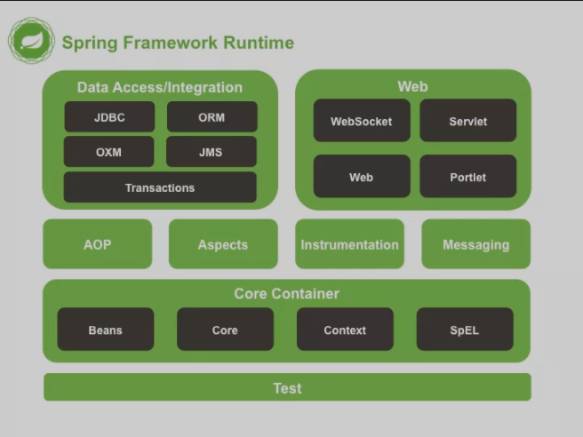

#Spring
   ###Spring framework
       1.Spring Core： 基础,可以说 Spring 其他所有的功能都需要依赖于该类库。主要提供 IOC 依赖注入功能。
       2.Spring Aspects ： 该模块为与AspectJ的集成提供支持。
       3.Spring AOP ：提供了面向方面的编程实现。
       4.Spring JDBC : Java数据库连接。
       5.Spring JMS ：Java消息服务。
       6.Spring ORM : 用于支持Hibernate等ORM工具。
       7.Spring Web : 为创建Web应用程序提供支持。
       8.Spring Test : 提供了对 JUnit 和 TestNG 测试的支持。
   
   ###Spring 官⽹列出的 Spring 的 6 个特征
       1. 核心技术 ：依赖注入(DI)，AOP，事件(events)，资源，i18n，验证，数据绑定，类型转换，SpEL。
       2. 测试 ：模拟对象，TestContext框架，Spring MVC 测试，WebTestClient。
       3. 数据访问 ：事务，DAO支持，JDBC，ORM，编组XML。
       4. Web支持 : Spring MVC和Spring WebFlux Web框架。
       5. 集成 ：远程处理，JMS，JCA，JMX，电子邮件，任务，调度，缓存。
       6. 语言 ：Kotlin，Groovy，动态语言。
        
   ###IOC
       概念: IOC把创建和管理Bean的过程交给了IOC容器,由容器来负责创建\配置\和管理Bean.
             控制反转: 把控制bean的创建,管理的权利交给了ioc容器
             依赖注入: 容器加载了外部的文件、对象、数据，然后把这些资源注入给程序内的对象，维护了程序内外对象之间的依赖关系。
       好处: 解耦
       
   ####springBean的生命周期
        1.实例化Bean：Ioc容器通过获取BeanDefinition对象中的信息进行实例化，实例化对象被包装在BeanWrapper对象中
        2.设置对象属性（DI）：通过BeanWrapper提供的设置属性的接口完成属性依赖注入；
        3.注入Aware接口（BeanFactoryAware， 可以用这个方式来获取其它 Bean，ApplicationContextAware）：
            Spring会检测该对象是否实现了xxxAware接口，并将相关的xxxAware实例注入给bean
        4.BeanPostProcessor：自定义的处理（分前置处理和后置处理）
        5.InitializingBean和init-method：执行我们自己定义的初始化方法
        6.destroy：bean的销毁
   
   ####springbean循环依赖
        循环依赖都是通过构造方法是不能解决循环依赖的
        
        依赖情况	                    依赖注入方式	                                         循环依赖是否被解决
        AB相互依赖（循环依赖）	    均采用setter方法注入	                                            是
        AB相互依赖（循环依赖）	    均采用构造器注入	                                                否
        AB相互依赖（循环依赖）	    A中注入B的方式为setter方法，B中注入A的方式为构造器	                是
        AB相互依赖（循环依赖）	    B中注入A的方式为setter方法，A中注入B的方式为构造器	                否

        
        
       1.每次获取bean对象的时候 先从一级缓存中获取值
       
       2.在刚开始我们创建对象的是有一个循环,正常情况下是先创建A,再创建B,但是如果有循环依赖的话,我在创建A的过程中就要把B对象进行创建了
       
       3.一级缓存能不能解决循环依赖问题?  
           不能,如果只有一级缓存,那么就意味着完全状态和非完全状态的对象都存在,如果此时需要获取某个对象,恰巧获取到非完全状态的对象,怎么办?可以添加二级缓存
       
       4.二级缓存能不能解决问题? 为什么非要使用三级缓存?
           我们需要三级缓存的最主要意义就在于,你所需要的类有可能是简单对象,(实例化,初始化),也可能是需要进行代理的代理对象,
           当我向三级缓存中放置匿名内部类的时候,可以在获取的时候决定到底是简单对象,还是代理对象,这就是三级缓存存在的意义

   ####springioc九大后置处理器
        1.该后置处理器在spring AOP当中，spring如果判断当前类100%不需要进行增强，会把这个bean放到一个map中
        	，并将value置为false，那么在后面进行增强的时候，会排除这个map中的bean
        2.在推断使用哪一个构造函数的时候，会首先判断当前构造函数是否有@Value和@Autowired注解
        	，如果没有，那就校验当前构造方法对应的bean和传来的beanClass是否一样，如果是同一个，就把当前构造函数赋值给defaultConstructor
        	在第二次调用后置处理器的时候，会返回当前可用的构造函数，由此来决定，使用哪个构造函数来创建bean
        
        3.第三个后置处理器，是后面生命周期流程中的某些流程缓存一些meta信息
        	(1)将当前bean所依赖的bean(@Autowired和@Resource注解)存到一个map中，后面在进行属性注入的时候
        		，会先从这个map中找当前bean依赖的bean有哪些，如果map中为空，就再查找要注入的属性有哪些
        	(2)将@PostConstrct和@PreDestroy注解对应的方法，缓存起来，在后面调用初始化的后置处理器的时候，先从这里存的map中找方法，找到，就直接执行即可
        4.处理循环依赖问题会用到这个后置处理器,这里通过后置处理器，暴露出一个ObjectFactory（个人理解是一个bean工厂）
        	，可以完成bean的实例化等操作；这里的方法不会立即执行，只有执行到objectFactory.getObject()方法的时候，才会执行
        5.第五个后置处理器(判断是否需要填充属性)
        	如果我们需要在程序中自己注入属性，可以利用这个点，在这里返回false，那么spring就不会调用下面这个后置处理器来注入属性
        6.进行属性注入
        7.执行初始化方法@postconstruct
        8.对aop进行处理，对目标类生成代理对象
        9.销毁bean容器
   
   ###springboot启动流程
       ConfigurableApplicationContext方法
        1.计时器
        2.事件监听器
        3.读取配置文件,和准备上下文
        4.打印日志
        5.创建上下文
        6.异常报告监听
        7.springBean初始化 refresh

   ###spring bean的作用域有哪些?
        1.singleton : 唯一 bean 实例，Spring 中的 bean 默认都是单例的。
        2.prototype : 每次请求都会创建一个新的 bean 实例。
        3.request : 每一次HTTP请求都会产生一个新的bean，该bean仅在当前HTTP request内有效。
        4.session : 每一次HTTP请求都会产生一个新的 bean，该bean仅在当前 HTTP session 内有效。
        5.global-session： 全局session作用域，仅仅在基于portlet的web应用中才有意义，Spring5已经没有了。
            Portlet是能够生成语义代码(例如：HTML)片段的小型Java Web插件。它们基于portlet容器，可以像servlet一样处理HTTP请求。
            但是，与 servlet 不同，每个 portlet 都有不同的会话
    
   ###SpringAop和AspectjAop有什么区别?
        1.Spring AOP 属于运行时增强，而 AspectJ 是编译时增强。 
        2.Spring AOP 基于代理(Proxying)，而 AspectJ 基于字节码操作(Bytecode Manipulation)。
        
   ###Spring七大事务传播
        1. Propagation.REQUIRED: 
            在外围方法未开启事务的情况下Propagation.REQUIRED修饰的内部方法会新开启自己的事务，且开启的事务相互独立，互不干扰。
            在外围方法开启事务的情况下Propagation.REQUIRED修饰的内部方法会加入到外围方法的事务中，
                所有Propagation.REQUIRED修饰的内部方法和外围方法均属于同一事务，只要一个方法回滚，整个事务均回滚。
        2. Propagation.REQUIRES_NEW:
            在外围方法未开启事务的情况下Propagation.REQUIRES_NEW修饰的内部方法会新开启自己的事务，且开启的事务相互独立，互不干扰。
            在外围方法开启事务的情况下Propagation.REQUIRES_NEW修饰的内部方法依然会单独开启独立事务，
                且与外部方法事务也独立，内部方法之间、内部方法和外部方法事务均相互独立，互不干扰。
        3. PROPAGATION_NESTED:
            在外围方法未开启事务的情况下Propagation.NESTED和Propagation.REQUIRED作用相同，修饰的内部方法都会新开启自己的事务，且开启的事务相互独立，互不干扰。
            在外围方法开启事务的情况下Propagation.NESTED修饰的内部方法属于外部事务的子事务，外围主事务回滚，子事务一定回滚，
                而内部子事务可以单独回滚而不影响外围主事务和其他子事务
        4. PROPAGATION_SUPPORTS: 支持当前事务,如果当前没事务,已非事务方式运行
        5. PROPAGATION_MANDATORY: 使用当前事务,如果当前没有事务,抛异常
        6. PROPAGATION_NOT_SUPPORTED:  以非事务的方式执行, 如果当前存在事务,则把当前事务挂起
        7. PROPAGATION_NEVER: 已非事务方式执行,如果当前存在事务,则抛出异常  

   ###SpringMVC
        springmvc的工作原理、执行流程
         1.客户端（浏览器） 发送请求，直接请求到 DispatcherServlet.
         2.Dispatcherservlet 根据请求信息调用 HandlerNapping，解析请求对应的 Handler(Controller)，开始由 HandterAdapter 适配器处理，
         3.HandlerAdapter 会根据 Handter来调用真正的处理器开处理请求，井处理相应的业务逻辑。
         4.处理器处理完业务后，会返回一个Mode lAndView 对象，Model 是返回的数据对象，View 是个逻辑上的 View.
         5.ViewResoiver 会根据逻程 View 查找实际的 View.
         6.Dispaterservlet 把返回的 Model 传给 View （视图渲染），返回给请求者（浏览器）
            
  