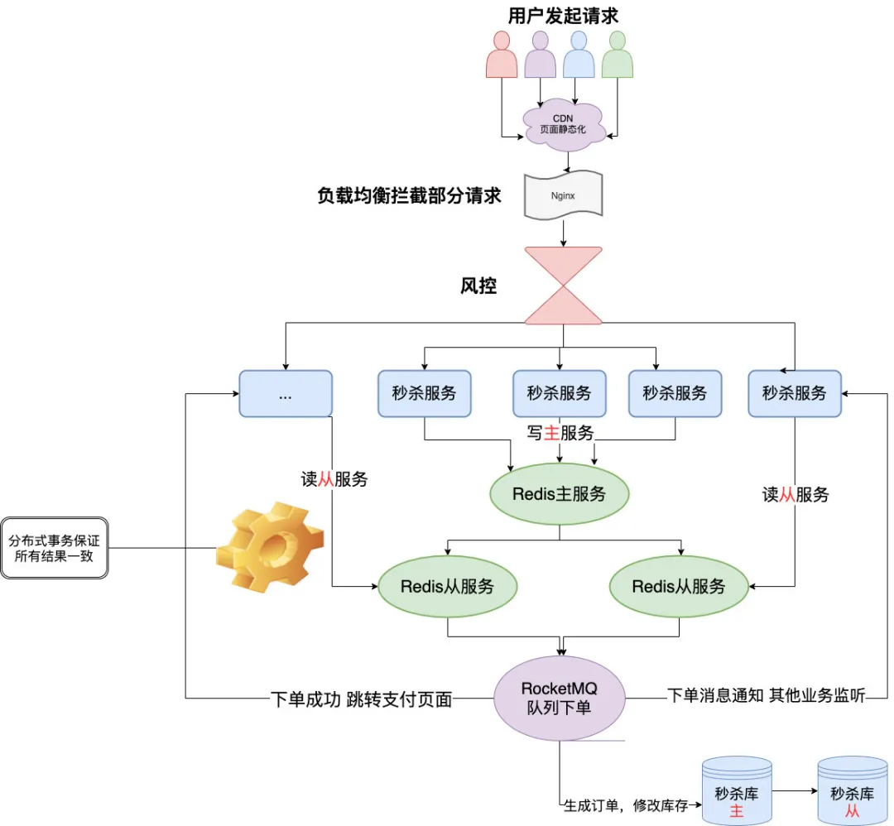

#系统架构:
   
   ###秒杀:
    设计架构思想:
        微服务思想,单独秒杀模块,秒杀专属数据库,熔断
        redis集群,主从,哨兵、
        nginx做负载均衡,限流
        风控:可以根据账号行为分析出这个账号机器人的概率大不大
    程序思想:
        所有的数据都放redis缓存,提高系统响应时间,在查询库存和减库存时,必须做原子操作(lua表达式等)
        动态url
        
